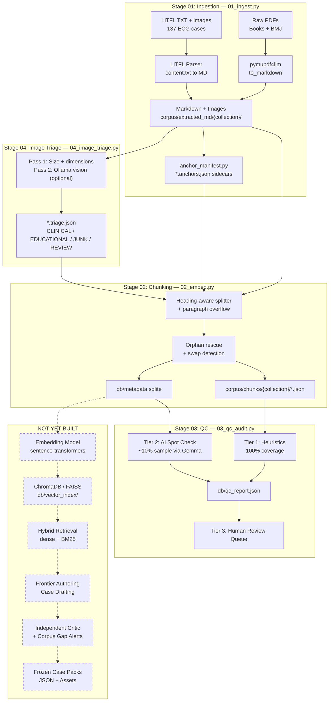

# Medii Pipeline: Comprehensive Audit, GAN-Style Evaluation & Best Practices

> **Purpose:** Adversarial (generator vs. discriminator) review of every pipeline stage, gap analysis of what's missing, pitfall catalog ranked by severity, and concrete recommendations for the next phase.
>
> **Methodology:** For each stage, a "generator" perspective (what the code does and why it's good) is pitted against a "discriminator" perspective (what can fail, what's suboptimal, what's missing). The tension produces a verdict with actionable recommendations.
>
> **Scope:** Analysis only. No code changes.

---

## Table of Contents

1. [Executive Summary](#1-executive-summary)
2. [Architecture Overview](#2-architecture-overview)
3. [Stage-by-Stage GAN Analysis](#3-stage-by-stage-gan-analysis)
   - 3.1 [Ingestion (01_ingest.py)](#31-stage-01-ingestion)
   - 3.2 [Chunking & Metadata (02_embed.py)](#32-stage-02-chunking--metadata)
   - 3.3 [QC Audit (03_qc_audit.py)](#33-stage-03-qc-audit)
   - 3.4 [Image Triage (04_image_triage.py)](#34-stage-04-image-triage)
   - 3.5 [Anchor Manifests (anchor_manifest.py)](#35-stage-05-anchor-manifests)
4. [Cross-Cutting Concerns](#4-cross-cutting-concerns)
5. [Missing Pipeline Stages (Gap Analysis)](#5-missing-pipeline-stages-gap-analysis)
6. [Pitfall Catalog](#6-pitfall-catalog-ranked-by-severity)
7. [Best Practices & Recommendations](#7-best-practices--recommendations)
8. [Recommended Execution Order](#8-recommended-execution-order)
9. [Dependency & Environment Notes](#9-dependency--environment-notes)

---

## 1. Executive Summary

The Medii pipeline is a well-structured, local-first data ingestion system that converts medical PDFs, BMJ guidelines, and LITFL ECG cases into chunked, metadata-rich Markdown. The architecture is sound: pause/resume, GPU monitoring, triage sidecars, and anchor manifests create a provenance chain from PDF page to chunk.

**What works well:**
- Sequential GPU-safe processing (respects the 8GB VRAM constraint)
- Robust pause/resume with progress persistence
- Image triage with a two-pass heuristic+vision strategy
- Anchor manifests that tie images to PDF pages and clinical context
- Orphan image rescue and swap detection in the chunker

**What is critically missing:**
- **Vector embeddings are not generated.** Despite `02_embed.py`'s name, it only chunks and stores text in SQLite. The `db/vector_index/` directory is empty. There is no retrieval capability. This is the single largest gap blocking the downstream PWA authoring pipeline.
- **BMJ boilerplate leaks through every stage** undetected.
- **No OCR/vision pipeline** for scan-only PDFs (acknowledged in AI_HANDOFF.md).
- **No CI or automated gate** prevents bad data from propagating downstream.

**Risk assessment:** The pipeline produces clean-enough data for ~70% of the corpus (text-rich PDFs). The remaining ~30% (image-heavy textbooks like 150_ECG_Problems, scan-only PDFs) will produce hollow or low-quality chunks. Without embeddings, the entire retrieval and authoring pipeline described in `medical_learning_pwa_1c60f761.plan.md` cannot begin.

---

## 2. Architecture Overview

### Current Pipeline (what exists and works)



### GAN-Style Evaluation Model

```
For each pipeline stage:

  GENERATOR (the code)          DISCRIMINATOR (adversarial audit)
  ========================      ==================================
  "Here is what I produce"  ->  "Here is what's wrong with it"
         |                              |
         v                              v
  Strengths identified          Failure modes cataloged
         |                              |
         +----------> VERDICT <---------+
                        |
              Concrete recommendations
              with file paths + line numbers
```

---

## 3. Stage-by-Stage GAN Analysis

### 3.1 Stage 01: Ingestion

**File:** `src/01_ingest.py` (448 lines)

#### Generator: What It Does Well

- **Multi-source routing:** Handles three distinct input formats (Books PDF, BMJ PDF, LITFL TXT+images) through a single pipeline with per-source logic.
- **Pause/resume:** `corpus/.ingest_progress.json` tracks completed files. `SIGINT` handler saves progress cleanly. Re-running resumes from where it left off. (Lines 40-78)
- **GPU monitoring:** Polls `nvidia-smi` every 5 files with a formatted bar graph. Useful for overnight runs. (Lines 83-103)
- **Deduplication:** BMJ PDFs are deduplicated by stem before processing, avoiding re-extraction of the same guideline from multiple specialty folders. (Lines 248-254)
- **Smart sample selection:** `pick_sample_pdfs()` picks the N largest files by size, avoiding tiny/placeholder PDFs that would produce misleading test results. (Lines 135-154)
- **Anchor integration:** Calls `write_manifest()` or `write_litfl_manifest()` after every successful extraction AND after skips, ensuring anchors are always up to date. (Lines 172-174, 201-203)

#### Discriminator: Failure Modes & Pitfalls

| Issue | Severity | Location | Detail |
|-------|----------|----------|--------|
| **TEST_MODE is hardcoded** | Medium | Line 370 | `TEST_MODE = True` requires editing source code for production runs. Should be a CLI arg or env var. |
| **Resume checks file existence, not completeness** | High | Lines 169-177 | If a crash occurs mid-write, a partial `.md` file is treated as "done." The progress key is added, and the file is never re-extracted. A size or hash check would catch this. |
| **No BMJ boilerplate stripping** | High | Entire BMJ path | BMJ PDFs contain repeated copyright/disclaimer blocks ("This PDF of the BMJ Best Practice topic is based on the web version..."). This text passes through ingestion, chunking, and embedding unfiltered. It pollutes the embedding space and wastes tokens during retrieval. |
| **Image-heavy PDFs produce hollow markdown** | Medium | Lines 190-198 | PDFs like `150_ECG_Problems.pdf` are mostly figures. `pymupdf4llm` extracts image refs but little text. The pipeline does not warn or flag these. The result is markdown files with dozens of `` refs and almost no clinical text. |
| **pymupdf4llm image paths are CWD-relative** | Medium | Lines 186-197 | Images are written to `images/{safe_stem}/` alongside the `.md`, but `pymupdf4llm` may write references relative to CWD, not the `.md` file. This creates broken image refs depending on which directory the script is launched from. |
| **LITFL relative paths break on Windows** | Low | Lines 329-331 | `os.path.relpath()` from the output `.md` to the image folder can produce long `../../` chains that break in some viewers. |
| **No content validation after extraction** | Medium | Lines 190-208 | After writing the `.md`, there's no check that it contains meaningful content. A PDF that extracts to 3 lines of copyright text is marked "complete." |

#### Verdict & Recommendations

1. **Convert TEST_MODE to a CLI argument:** `--test` flag or `MEDII_TEST_MODE` env var. Two-line change.
2. **Add a minimum-content check after extraction:** If the `.md` is under 500 chars, log a warning and mark it for re-extraction or manual review.
3. **Add a BMJ boilerplate regex strip** at extraction time (before writing the `.md`). Target the repeated copyright block that appears in every BMJ PDF. This single fix improves chunk quality across the entire BMJ collection.
4. **Validate resume by file size:** Before skipping, check that the existing `.md` is above a minimum size threshold. If it's suspiciously small, re-extract.

---

### 3.2 Stage 02: Chunking & Metadata

**File:** `src/02_embed.py` (937 lines)

#### Generator: What It Does Well

- **Heading-aware splitting:** Sections are split by markdown headings with a breadcrumb path (`section_path`). This preserves semantic structure far better than naive fixed-window chunking. (Lines 218-271)
- **Merge + split strategy:** Small sections are buffered and merged until they hit `TARGET_CHUNK_CHARS` (4000). Oversized sections are split by paragraph. This avoids both tiny fragments and monster chunks. (Lines 277-343)
- **Triage-aware image filtering:** `_filter_junk_images()` strips markdown image refs tagged JUNK by the triage stage, preventing noise images from polluting chunks. (Lines 199-212)
- **Anchor-linked images:** Each chunk's images are enriched with `anchor_id`, `page_number`, `section_path`, `text_before`, `text_after`, and `peer_anchor_ids`. This metadata enables downstream retrieval failsafes. (Lines 374-425)
- **Orphan rescue:** After chunking, the pipeline detects non-JUNK images that didn't land in any chunk (because the text near them was too short to form a chunk) and places them in the chunk with the best text-context overlap. (Lines 431-519)
- **Swap detection and auto-correction:** Detects when two adjacent images each fit the other's chunk better (a common artifact of fixed-window splitting on image-dense pages) and auto-swaps them. (Lines 522-674)
- **LLM front-matter detection:** For books without a clear "Contents" heading, Gemma via Ollama can identify where clinical content begins. Conservative fallback: if unsure, keeps everything. (Lines 114-149)

#### Discriminator: Failure Modes & Pitfalls

| Issue | Severity | Location | Detail |
|-------|----------|----------|--------|
| **No embeddings are generated** | **Critical** | Entire file | Despite the filename `02_embed.py`, this script only chunks and stores text in SQLite. No vector embeddings are produced. `db/vector_index/` is empty. The entire retrieval pipeline is unimplemented. This is the single largest gap in the project. |
| **BMJ disclaimer text persists in chunks** | High | N/A (not addressed) | `_filter_junk_images()` strips JUNK image refs, but there is no equivalent text filter for repeated BMJ copyright blocks. These leak into chunks and will pollute embedding space when vectors are eventually generated. |
| **LLM front-matter detection requires Ollama** | Medium | Lines 114-149 | Falls back silently to "keep everything" if Ollama is offline. This means textbooks retain copyright pages, dedications, and TOC in their chunks when running without Ollama. No warning is logged about the quality impact. |
| **Chunk size is char-based, not token-based** | Low | Lines 42-45 | The ~4 chars/token heuristic is reasonable for English but less accurate for medical Latin terms (e.g., "pneumonoultramicroscopicsilicovolcanoconiosis"). Not a showstopper but may cause chunks to exceed embedding model token limits. |
| **Orphan rescue uses word-overlap scoring** | Medium | Lines 467-486 | Word overlap is a crude similarity metric. In medical text where terminology is repetitive across sections (e.g., "patient," "diagnosis," "treatment" appear everywhere), this can place images in the wrong chunk. |
| **No idempotency guard** | Medium | Lines 748-851 | Re-running the chunker on the same collection overwrites existing chunks (INSERT OR REPLACE). If the corpus changed between runs, orphan chunks from deleted `.md` files persist in SQLite. There's no "clean and rebuild" mode. |
| **LITFL defaults all images to CLINICAL** | Low | Lines 183-193 | When no triage JSON exists for LITFL images, they're defaulted to CLINICAL. This is usually correct (curated ECGs) but could misclassify non-ECG decorative images if they exist. |

#### Verdict & Recommendations

1. **Implement actual embedding generation (critical path).** Add a `--embed` flag or a separate `05_embed_vectors.py` script that reads chunks from SQLite, generates vectors via `sentence-transformers`, and stores them in ChromaDB. This unblocks the entire downstream pipeline.
2. **Add a BMJ boilerplate text filter** alongside the existing image filter. A simple regex for the repeated disclaimer block would work. Apply it before chunking.
3. **Add a `--clean` flag** that drops and rebuilds chunks for a collection, removing stale orphans.
4. **Consider upgrading the orphan rescue** to use TF-IDF or lightweight cosine similarity instead of raw word overlap. The `sentence-transformers` dependency is already in `requirements.txt`.

---

### 3.3 Stage 03: QC Audit

**File:** `src/03_qc_audit.py` (414 lines)

#### Generator: What It Does Well

- **Three-tier system:** Tier 1 (heuristics, 100% coverage), Tier 2 (AI spot check, ~10% sample), Tier 3 (human review queue). Good separation of fast/cheap checks from expensive LLM calls. (Lines 58-198, 258-344, 350-377)
- **Comprehensive Tier 1 checks:** Empty files, garbled text (non-ASCII ratio), missing headers, encoding loss (U+FFFD), broken image refs, missing anchor manifests, front-matter leakage, chunk size outliers, orphan images. (Lines 58-198)
- **Structured AI prompts:** The coherence check prompt is well-designed with clear issue codes (GARBLED, FRONTMATTER, TRUNCATED, INCOHERENT). The image-context prompt checks clinical relevance. (Lines 204-232)
- **Reproducible sampling:** `RANDOM_SEED = 42` ensures the same chunks are sampled across runs, making QC results comparable over time. (Line 52)
- **JSON report output:** All findings are compiled into a structured `qc_report.json` with severity levels. (Lines 350-377)
- **CLI flexibility:** `--collection`, `--tier`, `--sample-pct`, `--model` flags allow targeted runs. (Lines 383-404)

#### Discriminator: Failure Modes & Pitfalls

| Issue | Severity | Location | Detail |
|-------|----------|----------|--------|
| **Tier 2 silently skips when Ollama is offline** | High | Lines 267-275 | If Ollama is unreachable, Tier 2 prints "skipping" and returns an empty list. The final report shows 0 AI findings, which could be misread as "everything is clean" rather than "AI checks didn't run." The report should include a `tier2_skipped: true` flag. |
| **Front-matter check is books-only** | Medium | Lines 121-129 | BMJ disclaimer text (`frontmatter_signals` list) is only checked for `collection == "books"`. BMJ copyright blocks are not caught because the check explicitly excludes BMJ ("BMJ/LITFL naturally contain these terms"). But BMJ boilerplate is different from BMJ clinical content. |
| **No CI integration** | Medium | N/A | QC is manual-run only. Nothing prevents a developer from running ingestion + chunking and skipping QC. Consider a `--gate` mode that returns exit code 1 if errors exceed a threshold. |
| **Image-context check has low coverage** | Low | Lines 322-340 | Only checks images with `triage_label == "CLINICAL"` in the sampled chunks. EDUCATIONAL images and images with missing triage labels are skipped. |
| **No trend tracking** | Low | Lines 350-377 | Each QC run overwrites `qc_report.json`. There's no history of QC scores over time. Hard to tell if pipeline changes improved or degraded quality. |
| **urllib for HTTP calls** | Low | Lines 235-255 | Uses `urllib.request` instead of the `requests` library (which is a dependency). Works but is harder to debug, lacks retries, and the timeout handling is less graceful. |

#### Verdict & Recommendations

1. **Add a `tier2_ran: bool` field to the report.** When Ollama is offline, the report should clearly indicate that AI checks were skipped, not that they passed.
2. **Extend front-matter detection to BMJ.** Add a BMJ-specific boilerplate regex (the "This PDF of the BMJ Best Practice..." disclaimer) to the Tier 1 checks.
3. **Add `--gate` mode** that exits with code 1 when error count exceeds a configurable threshold. This enables CI integration.
4. **Append QC reports with timestamps** instead of overwriting. Store as `qc_report_{ISO_date}.json` or a JSONL append log.

---

### 3.4 Stage 04: Image Triage

**File:** `src/04_image_triage.py` (458 lines)

#### Generator: What It Does Well

- **Two-pass strategy:** Pass 1 (instant heuristics: size + dimensions) classifies obvious JUNK and obvious CLINICAL. Pass 2 (optional Ollama vision model) handles the grey zone (10-50KB). This avoids burning GPU on obvious cases. (Lines 40-101, 107-183)
- **Well-tuned thresholds:** `< 10KB = JUNK`, `> 50KB = CLINICAL`, with dimension checks for small files and banner detection (`h < 80 and w > 400`). Tuned from visual inspection of Robbins + BMJ. (Lines 40-45, 60-101)
- **Per-document triage sidecars:** Each document gets a `{stem}.triage.json` with per-image labels and reasons. This makes the triage results inspectable and debuggable. (Lines 249-263)
- **Ollama model validation:** Checks both server availability and model presence before attempting vision classification. Gives helpful error messages with install commands. (Lines 121-143)
- **Vision batch limit:** Caps the number of images sent to the vision model per run (default: 200), preventing runaway GPU usage. (Lines 195-196)

#### Discriminator: Failure Modes & Pitfalls

| Issue | Severity | Location | Detail |
|-------|----------|----------|--------|
| **10KB threshold kills small clinical diagrams** | Medium | Line 40, 76-83 | Small but clinically relevant images (flow charts, small tables rendered as images, simple anatomical diagrams) are classified as JUNK if under 10KB. The dimension check (64x64 minimum) helps but doesn't save all cases. Medical flow charts can be 8KB and 300x200px. |
| **Vision model defaults to Gemma 4 E4B** | Medium | Line 107 | The plan document explicitly warns against using E4B as a workhorse model due to the 8GB VRAM constraint. For vision classification of potentially hundreds of images, a lighter model (e.g., `gemma3:4b`) would be safer and faster. The `--model` flag exists but the default should change. |
| **Grey zone is wide (10-50KB)** | Low | Lines 40-45 | ~30% of medical images in a typical textbook fall in the 10-50KB range. Without Pass 2 (vision), these are left as REVIEW, meaning they're neither embedded nor discarded. Downstream stages treat REVIEW inconsistently. |
| **No feedback loop** | Low | N/A | Triage results don't update when images change. If a new extraction produces different images, stale triage JSONs persist. The triage doesn't check if its sidecar is older than the images directory. |
| **qc_sample_check uses unseeded random** | Low | Line 321 | Unlike Tier 2 in `03_qc_audit.py` (which uses `RANDOM_SEED = 42`), the QC sample check in this file uses `random.sample()` without a seed, producing non-reproducible results. |
| **PIL dependency is soft** | Low | Lines 51-57 | `_image_dimensions()` tries PIL but silently returns None if unavailable. Without dimensions, grey-zone images can't be classified by shape, reducing triage accuracy. PIL (Pillow) is not in `requirements.txt`. |

#### Verdict & Recommendations

1. **Lower the JUNK threshold to 5KB** and add a whitelist for images with dimensions >= 200x150 (likely diagrams even if small).
2. **Change the default vision model** from `gemma4:e4b` to a lighter vision model. The `--model` flag is already there; just change the default.
3. **Add Pillow to `requirements.txt`.** It's likely already installed as a transitive dependency, but making it explicit ensures dimension checks always work.
4. **Add staleness detection:** Compare triage JSON mtime against the images directory. If images are newer, re-triage.
5. **Seed the random in `qc_sample_check`** for reproducibility.

---

### 3.5 Stage 05: Anchor Manifests

**File:** `src/anchor_manifest.py` (403 lines)

#### Generator: What It Does Well

- **Stable document IDs:** `stable_doc_id()` generates a SHA-256-based ID from `medii:{collection}:{stem}`. Deterministic, collision-resistant, and portable across machines. (Lines 31-34)
- **Page-level provenance:** For PDF-extracted images, parses the pymupdf4llm filename pattern (`{stem}.pdf-{page}-{seq}.png`) to extract the source page number. This enables "click image to see original PDF page" in the future PWA. (Lines 19-23, 53-65)
- **Section path tracking:** Maintains a heading stack that tracks the full breadcrumb path (`[Chapter 5, Pathology, Gross Findings]`) for each image. Critical for contextual retrieval. (Lines 37-48)
- **Surrounding text windows:** Captures 1200 chars before and 800 chars after each image reference, providing context for image-text coherence scoring. (Lines 73-103, 175-178)
- **Same-page peer grouping:** Groups images that share a PDF page, enabling "show me all figures from this page" queries. (Lines 204-214)
- **LITFL-specific handling:** LITFL cases have no PDF pages, so the manifest uses `medii:litfl:{stem}:m{N}` anchors and attaches a clinical section excerpt instead. (Lines 275-334)
- **CLI for rebuild:** Supports per-file, per-directory, and scan-all modes for regenerating anchors without re-running full ingestion. (Lines 337-399)

#### Discriminator: Failure Modes & Pitfalls

| Issue | Severity | Location | Detail |
|-------|----------|----------|--------|
| **pymupdf4llm filename format is hardcoded** | Medium | Lines 19-23 | The regex `{stem}.pdf-{page}-{seq}.{ext}` assumes a specific pymupdf4llm output format. If the library updates its naming convention, all page extraction silently fails (returns None instead of page numbers). |
| **CWD-dependent path resolution** | Medium | Lines 106-124 | `_resolve_rel_to_md()` tries multiple path resolution strategies (relative to .md, then relative to CWD). This works but is fragile. If the script is run from a different directory, the same image may get a different `image_rel_to_md` path. |
| **Absolute paths in manifest** | Low | Lines 249, 307, 328 | `markdown_path`, `pdf_path`, and `case_folder` are stored as absolute paths. This breaks portability: manifests generated on one machine won't have valid paths on another. Consider storing relative-to-MEDII_BASE paths. |
| **No schema validation** | Low | N/A | The manifest is a dict written to JSON. There's no JSON Schema or Pydantic model to validate structure. A missing field would only be caught when a downstream stage tries to access it. |
| **Clinical section excerpt is truncated** | Low | Lines 299-301, 313 | LITFL clinical excerpts are capped at `CONTEXT_BEFORE_MAX` (1200) chars. For long case discussions, this may miss the differential diagnosis or management plan. |

#### Verdict & Recommendations

1. **Store paths as relative-to-MEDII_BASE** in the manifest. Keep absolute paths available via a runtime helper function.
2. **Add a version check for pymupdf4llm** that warns if the library version doesn't match the expected filename format. One assert at import time.
3. **Consider a Pydantic model** for the manifest schema. This would catch structural errors at write time rather than downstream. The `pydantic` dependency is already in `requirements.txt`.

---

## 4. Cross-Cutting Concerns

### 4.1 VRAM Management & Sequential Execution

**Status: Well-handled.** The pipeline processes one file at a time, never loads multiple models concurrently, and monitors GPU usage. The `OLLAMA_NUM_PARALLEL=2` setting (configured in the environment) is safe for 8GB VRAM when using Gemma 4 E4B.

**Risk:** The `02_embed.py` script will eventually need to run an embedding model (e.g., `all-MiniLM-L6-v2` at ~80MB) alongside Ollama for LLM front-matter detection. These can coexist on 8GB, but the embedding model should be loaded once and reused, not re-instantiated per file.

### 4.2 Data Provenance Chain

```
PDF Page → pymupdf4llm → Markdown Line → anchor_manifest.py → anchors.json
                                              ↓
                          Image filename ← page_number_1, figure_index, section_path
                                              ↓
                          02_embed.py → chunk has [anchor_id, page, section_path, text_before, text_after]
                                              ↓
                          (future) → vector embedding carries provenance metadata
                                              ↓
                          (future) → retrieval result shows "Source: Robbins p.142, Figure 5-3"
```

**Status: Solid design, partially implemented.** The provenance chain from PDF page to chunk is complete. The chain from chunk to vector to retrieval result is not yet built.

**Risk:** If the embedding stage doesn't carry `anchor_id` and `page_number` into the vector metadata, the provenance chain breaks at the most important point (the one the end user sees).

### 4.3 Pause/Resume & Idempotency

**Status: Partially implemented.** Ingestion (`01_ingest.py`) has robust pause/resume. Chunking (`02_embed.py`) does not. QC (`03_qc_audit.py`) does not.

**Risk:** Re-running chunking on a modified corpus leaves stale chunks in SQLite. There's no "diff" mode that only re-chunks changed files.

**Recommendation:** Add a `last_modified` timestamp to the chunks table. Before re-chunking a file, compare the `.md` mtime against the stored timestamp. Skip if unchanged.

### 4.4 Front-Matter & Boilerplate Leakage

**This is the single most pervasive quality issue across the pipeline.**

| Source | Boilerplate Content | Where It Leaks | Impact |
|--------|-------------------|----------------|--------|
| **Books** | Title pages, copyright, dedication, TOC, author bios | Into chunks if no "Contents" heading is found and Ollama is offline | Medium: wastes embedding space, dilutes retrieval |
| **BMJ** | "This PDF of the BMJ Best Practice topic is based on the web version last updated: {date}. BMJ Best Practice topics are regularly updated..." | Into every BMJ chunk, every collection | **High: repeated across every BMJ document, creates a massive cluster of near-duplicate embeddings** |
| **LITFL** | Minimal (curated content) | N/A | None |

**Recommended fix:** Add a `_strip_boilerplate()` function in `02_embed.py` (or `01_ingest.py`) with collection-specific regex patterns:

```python
BMJ_BOILERPLATE_RE = re.compile(
    r"This PDF of the BMJ Best Practice topic.*?(?=\n#|\Z)",
    re.DOTALL | re.IGNORECASE
)
```

### 4.5 Image-Text Coherence

**Status: Sophisticated.** The pipeline has three layers of image-text integrity:

1. **Anchor manifests** store `text_before` and `text_after` for each image.
2. **Orphan rescue** places unlinked images into the best-matching chunk.
3. **Swap detection** identifies and auto-corrects misplaced images.

**Remaining risk:** The word-overlap scoring used for orphan rescue is vulnerable to "vocabulary flooding" in medical text. Consider upgrading to TF-IDF or cosine similarity once `sentence-transformers` is being used for embeddings anyway.

### 4.6 Ollama Dependency & Model Availability

**Status: Fragile.** Four pipeline stages depend on Ollama:

| Stage | Dependency | Fallback When Offline |
|-------|-----------|----------------------|
| 01_ingest.py | None (Ollama not used) | N/A |
| 02_embed.py | LLM front-matter detection | Silent: keeps everything (may include boilerplate) |
| 03_qc_audit.py | Tier 2 AI spot check | Silent: returns empty findings (misleading) |
| 04_image_triage.py | Pass 2 vision classification | Explicit warning, leaves as REVIEW |

**Risk:** If Ollama is not running, the pipeline completes "successfully" but produces lower-quality output. The QC report shows 0 AI findings, which looks like a clean bill of health rather than "checks didn't run."

**Recommendation:** Add a startup health check at the beginning of each script that requires Ollama. Print a clear warning banner: "WARNING: Ollama not available. Quality will be degraded: [specific impacts]."

---

## 5. Missing Pipeline Stages (Gap Analysis)

### 5.1 Embedding Generation (CRITICAL PATH)

**Status: Not implemented. This is the #1 blocker.**

The chunking stage (`02_embed.py`) produces richly annotated chunks in SQLite, but no vector embeddings. The `sentence-transformers` library is in `requirements.txt` but never imported.

**What needs to be built:**
- Load chunks from SQLite (batch by collection)
- Generate embeddings via `sentence-transformers` (e.g., `all-MiniLM-L6-v2` for speed, or `BAAI/bge-base-en-v1.5` for medical text quality)
- Store in ChromaDB with metadata: `chunk_id`, `doc_id`, `collection`, `source_type`, `section_path`, `anchor_ids`, `page_numbers`
- Handle incremental updates (only embed new/changed chunks)

**VRAM note:** `all-MiniLM-L6-v2` uses ~80MB VRAM. Safe to run alongside Ollama on 8GB. Batch size of 32-64 is reasonable.

### 5.2 Vector Index Build (ChromaDB/FAISS)

**Status: Not implemented.**

ChromaDB is in `requirements.txt` and installed. The `db/vector_index/` directory exists but is empty.

**What needs to be built:**
- ChromaDB collection creation with cosine similarity
- Metadata filtering by collection, source_type, and tags
- A retrieval function that returns chunks with their full provenance (page numbers, anchor IDs, images)

### 5.3 OCR/Vision for Scan-Only PDFs

**Status: Acknowledged in AI_HANDOFF.md, not implemented.**

Image-heavy PDFs (e.g., `150_ECG_Problems.pdf`) produce near-empty markdown. These need:
- OCR via Tesseract or EasyOCR for text extraction from scanned pages
- Vision model (Gemma/LLaVA) for describing clinical images
- Integration with the existing anchor manifest to maintain provenance

**VRAM concern:** OCR models + vision models on 8GB will require sequential, not parallel execution.

### 5.4 Audio/ASR Pipeline

**Status: Not started. Directory exists (`corpus/raw_audio/`).**

The plan mentions audio content (heart sounds, spoken explanations). This requires:
- ASR (Whisper) for transcription
- Speaker diarization for lecture content
- Timestamp alignment for "click to hear" in the PWA

**VRAM concern:** Whisper small/medium fits on 8GB. Whisper large does not.

### 5.5 Golden Retrieval Tests (qrels)

**Status: Not implemented. Critical for quality assurance.**

Before the authoring pipeline can begin, you need a small set of "known good" query-document pairs to validate that retrieval is working correctly:
- 20-30 medical questions with known correct source documents
- Automated test: "does the top-5 retrieval include the correct document?"
- Regression gate: block pipeline progression if recall drops below threshold

---

## 6. Pitfall Catalog (Ranked by Severity)

### Critical

| # | Pitfall | Impact | Fix Effort |
|---|---------|--------|------------|
| 1 | **No embeddings generated** | Entire retrieval and authoring pipeline is blocked | Medium (1-2 days) |
| 2 | **No vector index** | Cannot search the corpus | Medium (paired with #1) |

### High

| # | Pitfall | Impact | Fix Effort |
|---|---------|--------|------------|
| 3 | **BMJ boilerplate leaks through all stages** | Pollutes embedding space, wastes retrieval tokens, degrades chunk quality across entire BMJ collection | Low (regex filter) |
| 4 | **Resume logic doesn't validate completeness** | Crashed extractions produce permanent hollow files | Low (size check) |
| 5 | **QC Tier 2 silently skips without warning in report** | False sense of quality when Ollama is offline | Low (add flag to report) |

### Medium

| # | Pitfall | Impact | Fix Effort |
|---|---------|--------|------------|
| 6 | **TEST_MODE hardcoded in source** | Production runs require code editing | Trivial (CLI arg) |
| 7 | **No OCR for scan-only PDFs** | ~30% of textbook content is inaccessible | High (new pipeline stage) |
| 8 | **Image triage 10KB threshold kills small diagrams** | Some clinical diagrams classified as JUNK | Low (adjust threshold) |
| 9 | **Stale chunks in SQLite after re-runs** | Orphan data from deleted/changed source files | Low (add clean mode) |
| 10 | **Absolute paths in anchor manifests** | Not portable across machines | Low (store relative paths) |
| 11 | **Orphan rescue uses crude word overlap** | Images may be placed in wrong chunks | Medium (upgrade to TF-IDF) |
| 12 | **No CI gate for QC** | Bad data can propagate without checks | Low (exit code) |

### Low

| # | Pitfall | Impact | Fix Effort |
|---|---------|--------|------------|
| 13 | **Char-based chunk sizing** | May exceed embedding model token limits for medical Latin | Trivial (use tiktoken) |
| 14 | **Pillow not in requirements.txt** | Image dimension checks may silently fail | Trivial |
| 15 | **No QC trend tracking** | Can't measure quality improvements over time | Low (timestamped reports) |
| 16 | **qc_sample_check unseeded random** | Non-reproducible QC results in image triage | Trivial |

---

## 7. Best Practices & Recommendations

### Immediate Actions (unblock the pipeline)

1. **Build the embedding stage.** Create `src/05_vectorize.py` that reads chunks from SQLite, generates embeddings via `sentence-transformers`, and stores them in ChromaDB with full provenance metadata. This is the single most important next step.

2. **Strip BMJ boilerplate.** Add a regex filter in `02_embed.py` before chunking. This is a 10-line fix that improves quality across the entire BMJ collection.

3. **Fix the QC report** to include `tier2_ran: true/false` so Ollama outages don't masquerade as clean audits.

### Short-Term Improvements (quality and robustness)

4. **Add content validation** after PDF extraction (minimum size check, non-ASCII ratio check).
5. **Convert TEST_MODE to a CLI argument.**
6. **Add `--clean` mode** to the chunker for rebuild scenarios.
7. **Build 20-30 golden retrieval test cases** (qrels) for regression testing.
8. **Lower the JUNK threshold** from 10KB to 5KB and add dimension-based overrides.

### Medium-Term (new capabilities)

9. **OCR pipeline** for scan-only PDFs (Tesseract + vision model descriptions).
10. **Hybrid retrieval** (dense vectors + BM25 keyword matching) for the vector index.
11. **Incremental re-chunking** (track `.md` mtime, only re-process changed files).
12. **CI integration** with QC gate (fail the pipeline if error count exceeds threshold).

### Architecture Principles

- **Sequential GPU execution.** Never run two GPU-heavy models concurrently. Load embedding model once, process all chunks, unload, then run Ollama tasks.
- **Provenance is sacred.** Every chunk must carry enough metadata to trace back to the original PDF page and figure. Never strip `anchor_id` or `page_number` from chunk metadata.
- **Fail loudly, not silently.** When Ollama is offline, warn clearly about degraded quality. When a PDF produces empty output, flag it, don't mark it "complete."
- **Idempotency.** Every pipeline stage should be safely re-runnable without accumulating stale data.

---

## 8. Recommended Execution Order

```
# 1. Full ingestion (set TEST_MODE=False or use --full flag)
python src/01_ingest.py

# 2. Image triage (heuristic pass, optionally with vision)
python src/04_image_triage.py
python src/04_image_triage.py --vision --model gemma3:4b    # for grey zone

# 3. Chunking
python src/02_embed.py
python src/02_embed.py --llm-frontmatter                    # if Ollama is available

# 4. QC audit
python src/03_qc_audit.py
python src/03_qc_audit.py --tier 2 --sample-pct 20          # deeper AI check

# 5. [NOT YET BUILT] Vectorize
# python src/05_vectorize.py

# 6. [NOT YET BUILT] Golden retrieval tests
# python src/06_eval_retrieval.py --qrels tests/qrels.json

# 7. [NOT YET BUILT] Authoring pipeline
# (scope, split, RAG, draft, critic, revise, export case packs)
```

**Note:** Steps 1-4 can be run without Ollama (with degraded quality). Steps 2 (vision pass) and 3 (LLM front-matter) benefit from Ollama being active.

---

## 9. Dependency & Environment Notes

### Current Dependencies (`requirements.txt`)

| Package | Used By | Status |
|---------|---------|--------|
| `docling` | Not used in any script | Unused (consider removing) |
| `unstructured` | Not used in any script | Unused (consider removing) |
| `sentence-transformers` | Intended for 02_embed.py | Installed but not imported |
| `chromadb` | Intended for vector index | Installed but not used |
| `medspacy` | Not used in any script | Unused (future NER?) |
| `ollama` | Not used (scripts use urllib directly) | Unused (scripts use REST API) |
| `tqdm` | 01_ingest.py, 04_image_triage.py | Active |
| `pydantic` | Not used in any script | Unused (consider for schemas) |
| `rich` | Not used in any script | Unused (consider for CLI output) |
| `pymupdf4llm` | 01_ingest.py | Active (core dependency) |

**Observation:** Several heavy dependencies (`docling`, `unstructured`, `medspacy`) are installed but unused. This adds ~2GB to the virtual environment. Consider removing them until they're needed.

### Hardware Profile

| Component | Spec | Pipeline Impact |
|-----------|------|----------------|
| GPU | RTX 3070 (8GB VRAM) | Limits concurrent model usage. One model at a time. |
| VRAM Budget | ~6.5GB usable (after OS overhead) | Gemma 4 E4B: ~4GB. Embedding model: ~0.1GB. Can coexist. |
| Storage | Local SSD (assumed) | Corpus + chunks + vectors ≈ 5-10GB for full library |

### Ollama Model Recommendations

| Task | Recommended Model | VRAM | Notes |
|------|------------------|------|-------|
| Front-matter detection | `gemma4:e4b` | ~4GB | Current default. Appropriate. |
| QC coherence check | `gemma4:e4b` | ~4GB | Current default. Appropriate. |
| Image vision triage | `gemma3:4b` | ~3GB | Lighter than E4B. Better default for batch vision. |
| Future: case authoring | Frontier model (API) | N/A | Too complex for local 8GB. Use cloud API. |

---

*Document generated by adversarial pipeline audit. All file references verified against the repository at commit `397b4be`.*
