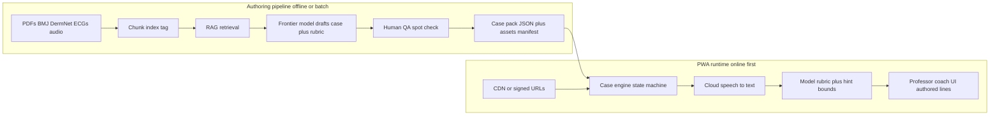
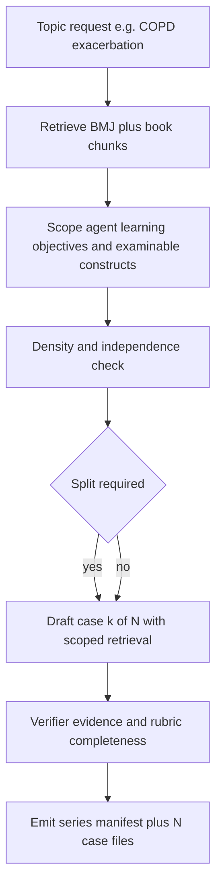
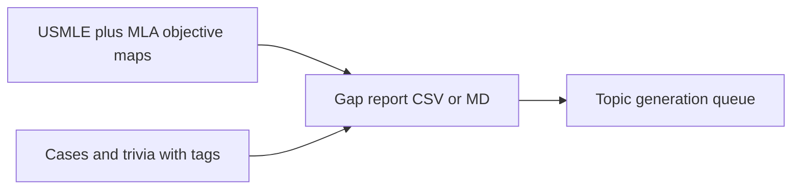
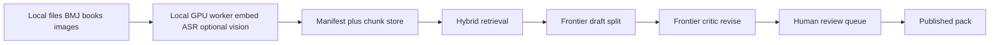

# Medical knowledge PWA (case-based + curriculum-tagged)

## What you are building (in one sentence)

A **personal study client** that plays **structured scenarios** (including **OSCE-style spoken stations**, **ranking**, **image pin / hotspot** localisation on radiology–pathology–histopathology-style images and **composite teaching plates** (e.g. scar atlases), and typed answers) from **versioned content packs** you control—**anchored primarily to UK clinical management** (NICE, BMJ, UK-oriented handbooks) **while using Republic of Ireland sources for national immunisation and cancer screening schedules** and **Irish health law** where the stem is ROI-relevant—surfaces **verified trivia** (handbook gems, “consultant perspective” prompts—only after you approve), pulls **linked media** (heart sounds, ECGs, derm images, guideline snippets), and uses an **online** stack (STT + grading) with a **Duolingo-style professor coach** driven by **frozen JSON** you authored.

## Core design principle: separate “authoring time” from “study time”

(STT sits on **spoken** branches only; typed/ranking paths skip it.)

**Why this split matters for quality and safety**

- **Hallucination risk** is highest when a model improvises a new patient and management plan live. Your approach (frontier + RAG **while building** cases, then **freeze** the case) is the right pattern for a doctor-facing tool.
- **Grading nuance** comes from **rubric design**: exemplar answers, “must mention” concepts, acceptable synonyms, common dangerous omissions, and scoring bands (e.g., partial credit rules). The runtime model’s job is to **map learner text to the rubric**, not to invent medicine.

## Recommended case-pack data model (portable, git-friendly)

Store cases as **JSON (or YAML) in a repo** with a strict schema, plus an **assets manifest** (paths, checksums, MIME types). Each case should include:

- **Metadata**: unique `caseId`, version, **`tags[]`**, optional **`primaryTag`**, optional **`stationTags`** per station, **`estimatedMinutes`** (whole case, learner-facing).
- **`caseComplexity`** (author, **orthogonal to** user **`studyDifficulty`**): `brief` | `standard` | `deep` | `extended` — describes **how big the clinical story is** (decision points, phases of care, subspecialty crossovers), not how scaffolded questions are. Examples: **viral URTI** → `brief`; **Whipple pathway** → `extended` (often a **series** of cases, not one file).
- **`importance` / `criticality`**: `routine` | `high_yield` | **`red_flag_must_not_miss`** — drives **human review priority**, **study queue sorting**, and **rubric strictness on dangerous omissions** (e.g. **PE in malignancy**, **cord compression**, **ectopic pregnancy**). Red-flag cases should **never** be “softened” by easy mode on safety-critical stations (see below).
- Optional **`prerequisiteCaseIds[]`** or **`suggestedPriorTags[]`** for `deep` / `extended` cases so the UI can warn “foundations first.”
- **Jurisdiction and evidence routing (v1 — your hybrid rule)**:
  - **Clinical management (diagnosis, treatment, most inpatient/acute pathways)**: default **`clinicalEvidenceJurisdiction: UK`** — rubrics and **gold “next step”** come from **UK-tagged** chunks (NICE, BMJ, UK handbooks, etc.) unless you deliberately author an all‑ROI clinical case.
  - **Population programmes — always Irish gold for ROI study**: for stations about **national immunisation schedule** (vaccines, ages, intervals, contraindications as per **national programme**) or **cancer screening** (eligibility, intervals, programme names, referral pathways), set **`stationScheduleJurisdiction: IE`** (or equivalent per-station flag) and retrieve **HSE / NCPS / Irish college** (etc.) chunks only for those answers—**do not** use **UK Green Book / NHS screening** dates as gold when the learner expectation is **Ireland**.
  - **`legalJurisdiction`** (optional; **required** on stations that touch **statute / capacity / mental health law / motoring medical fitness / coroner–medicolegal reporting**): **`IE`** when the stem is ROI—match **Irish law** and **HSE safeguarding** framing to **IE-tagged** sources; never grade legal OSCE lines against **UK-only** statute wording.
  - **`guidelineProfile`** on the case (keep for tooling/UI): e.g. **`UKClinical_IEProgrammes`** as a **named preset** meaning “UK medicine + IE schedules + IE law when flagged,” or continue explicit **`UK` | `IE` | `UK-IE`** if you prefer—**linter enforces**: any station tagged **`immunisation`** / **`cancer_screening`** must have **`stationScheduleJurisdiction: IE`** for your product defaults.
  - **Retrieval bias**: RAG picks chunks by **station role**—**clinical** → UK bias; **schedule** (vax/screen) → IE bias; **legal** → matches **`legalJurisdiction`**. Deprioritise **US-only** gold unless you widen scope later.
  - **Runtime / grader**: pass **`clinicalEvidenceJurisdiction`**, per-station **`stationScheduleJurisdiction`**, and **`legalJurisdiction`** (when set) so the model applies the **right rubric family** (e.g. screening ages).
  - **Learner UX**: **no mandatory toggle in v1** if packs encode the above; optional later: highlight “schedule station — Ireland programme” in UI for transparency.
- **Future extension — US / transatlantic compare (not v1)**:
  - Optional later: **`transatlanticNotes[]`**, **`rubricVariants: { UK, US }`**, side-by-side teaching—reintroduce when you want it.
- **Presentation graph**: nodes for **history**, **exam findings**, **investigations unlock rules** (e.g., only after you order troponin), **branching** optional but start linear.
- **Prompts shown to the learner** (the “voice of the case”).
- **Media refs**: `assetId` for audio loops, ECG PNG/SVG, derm images, PDF page ranges (or pre-extracted text snippets you have rights to embed).
- **Question / station objects** (extend as you grow):
  - type: `mcq` | `ranking` (order options by appropriateness / next step) | `ordered_steps` | `short_answer` | `long_answer` | `spot_diagnosis_image` | `interpretation` (ECG) | `osce_spoken` (timed verbal response) | **`image_pin`** (learner taps image; compare to target point or polygon in **normalized coordinates** with a **tolerance radius** or **IoU** rule—fully deterministic scoring). Optional **`imagePinKind`** / tags document pedagogy: e.g. **composite scar plate** (several scars on one diagram—pin the scar matching the stem’s operation, then a **follow-up station** names the procedure); **single scar / wound**; **derm** focus; **radiology** pointer; **histopath** region; **ECG territory** (static image); **anatomy landmark** plates; **examination sign** arrays. **Composite cartoons** are exam-useful but need **clear rights** (commission, open-licensed art, or your own asset)—do not ship random web cartoons unchecked.
  - **gold standard** (for MCQ/ordering/ranking/pin geometry—keep deterministic where possible)
  - **rubric** (for text and speech): required concepts, acceptable synonyms, **discriminators** (the specific phrases that separate “pass” vs “borderline”), dangerous omissions, partial-credit bands
  - **Hint policy** (per station or inherited from case): `maxHints`, **when hints are allowed** (e.g., only after first attempt or after N seconds), **strictness** (`exam_strict` | `supportive`), **forbidden hint content** (no giving the diagnosis outright; only nudge toward a domain), optional **hint scripts** authored in the pack so the runtime model paraphrases within bounds rather than inventing new facts
- **Case series metadata** (when a topic was split): `seriesId`, `seriesIndex`, `seriesTotal`, `prerequisiteCaseIds[]`, shared `learningObjectives[]` split across cases
- **Teaching notes** (post-reveal): concise learning points + **source citations** (BMJ doc id + section, book chapter, etc.)

**Presentation variability (same clinical spine, different “skin”—replay feels different)**

- **Goal**: one **`caseId`** (e.g. ACS) can play as **different believable presentations**—**man vs woman**, age band, comorbidity flavour, slightly different history/exam/ICE wording, **atypical-but-fair** stems—so a student repeating the case does not get **identical** text. The **diagnosis, management gold, and safety-critical rubric** stay on one **shared spine**; only **surface narrative** changes.
- **Authoring (Frontier / heavy models)**: draft **`presentationVariants[]`** — each entry is **fully specified JSON** (stem fragments, demographics, optional per-station prompt overrides, asset refs if ECG/image differs). **Verifier + critic** must confirm **clinical equivalence** (same pathway, no new contraindications snuck in) and **linter** rejects variants that change **`stationScheduleJurisdiction`** or **legal** facts incorrectly.
- **Runtime resolution (before the first station)**:
  - **Default — no AI**: pick **`defaultPresentationVariantId`** if set, else **weighted random** or **round-robin** over `presentationVariants[]` using a **deterministic session seed** (stored per user+case so “retry” is stable until they finish or you bump pack version). **Zero model calls** for selection.
  - **Optional — small orchestrator model**: a **cheap mini-model** (not frontier) may **only choose among authored variant IDs** and optional **author-defined slots** (e.g. pick **one of three opening sentences** that were all pre-approved). Input: **`variantManifest` summary** + **`variantSelectionPolicy`** from the pack (forbidden combos, “prefer not repeating last variant”, weights). Output: **strict JSON** `{ chosenVariantId, optionalSlotChoices[] }` — **validated against the pack** server-side; **reject** if the model outputs an unknown id. The orchestrator **does not** invent symptoms, doses, or new investigations—**closed-world selection only**.
- **Merged case at playtime**: the client (or API) **materialises** one concrete case object by **deep-merging** spine + chosen variant, then runs the normal state machine. **Grader** always sees the **resolved** prompts + rubrics—same contract as today.
- **Why not let frontier improvise live?** Cost, latency, and **hallucination risk**. Keeping variability in **frozen, reviewed variants** preserves your **safety bar** while still giving **variety**.

**Difficulty modes — easy / medium / hard (same case, different scaffolding)**

- **User setting `studyDifficulty`**: `easy` | `medium` | `hard` (global or per-session). This does **not** change the **underlying diagnosis or correct management**—it changes **how much is revealed up front**, **question format**, **hint generosity**, and **how much the learner must generate unprompted**.
- **Per-station `modeVariants`** (recommended): for each `stationId`, optional objects **`easy`**, **`medium`**, **`hard`** (inherit missing fields from `medium` or a `base` block). Each variant may override:
  - **`stationType`** (e.g. easy = **`mcq`** or **`ordered_steps`** with partial options; hard = **`long_answer`** or **`osce_spoken`** expecting a **full structured list**—differentials, investigations, management headings).
  - **`learnerPrompt`**, **`revealedContext`** (easy may show more examination findings or investigation results earlier; hard withholds until ordered).
  - **`rubric` subset**: **`requiredConcepts`** may be **fewer** on easy (core pass line) vs **more** on hard (“list all key investigations / red flags”).
  - **`hintPolicy`** overrides (easy: more hints, supportive coach; hard: `exam_strict`, fewer hints, higher expectation of unprompted completeness).
- **Authoring**: frontier can draft **`modeVariants`** in one pass (structured JSON) with verifier checking **clinical equivalence** (same gold pathway, different surface); or you author **medium** first and expand easy/hard manually for v1.
- **Grader API**: receives **`activeDifficulty`** + the **selected variant’s rubric** so “pass” reflects the mode (hard mode expects broader recall where the rubric says so).
- **Safety invariant**: for **`importance: red_flag_must_not_miss`**, **easy** mode may **scaffold** wording but must **not** remove **unsafe omission penalties** from the rubric or **hide** the need to spot the emergency—encode **`safetyCriticalStationIds[]`** on the case if some stations must stay strict across all modes.

**How many stations / questions (not one number for everything)**

- **Station count is an output of scope**, not a fixed constant: **Stage 2** lists **examinable constructs**; each major construct typically maps to **one or more stations** (history branch, exam, investigation choice, interpretation, management step, communication/ICE).
- **Guideline bands (linter + critic)** — tune to your taste, example starting point:
  - **`brief`**: ~**3–7** stations (e.g. simple viral illness, single-pathway UTI).
  - **`standard`**: ~**6–12** stations (typical acute medical take).
  - **`deep`**: ~**10–16** stations **or** split into **`seriesId`** when **Stage 3** fires (multi-organ, long inpatient journey).
  - **`extended`**: **series by default** (e.g. **Whipple**: work-up → decision → complication → follow-up as **separate case files** linked by `seriesId`); if kept as one “marathon,” cap with **`maxStations`** only if you explicitly want that product shape.
- **Under/over detection**: **Stage 4.5 critic** flags **`too_few_stations_for_complexity`** and **`trivial_case_overlong`**; CI linter can **fail** when `stations.length` is outside the band for `caseComplexity` unless **`linterOverrideReason`** is set.
- **Optional extensions** and **trivia** do **not** count toward “core” station totals for complexity bands unless you choose to include them in the linter.

**Trivia / “extra” knowledge (Oxford Handbook, bedside culture, health-system context)** — treat as first-class **`trivia_card`** or **`perspective_note`** objects (lighter than full cases), still in the same pack repo:

- **Body text** is either (a) **verbatim or lightly edited** from a retrieved chunk with `chunkId` + publication metadata, or (b) marked **`authorVerified: true`** with **your explicit sign-off** in the authoring tool (timestamp, editor id). No `published` trivia without one of those.
- **Category tags** help tone and placement, e.g. `fact_handbook`, `exam_tip`, `systems_nice_population_tradeoff`, `history_eponym`, **`optional_deep_dive`** (voluntary “learn more” after a case), **`test_performance`** (sensitivity/specificity, LR+, LR−, **D-dimer** in PE, etc.), **`population_science`** (epidemiology, genetics, founder effects—only when **chunk-grounded** or **authorVerified**) — so the UI and professor coach know this is **reflective / exam-culture** content, not a dosing instruction.
- **Linked questions** optional: MCQ or short answer with rubric, same grading contract as cases.
- **Anti-hallucination rule in authoring**: any claim the verifier cannot attach to a chunk becomes **`pending_human_review`**; the batch job stops promoting that card until you edit, attach a source excerpt you are entitled to use, or delete.

**Optional “learn more” offers (professor — voluntary, not exam-blocking)**

- On each **case** (or after a specific **station**), optional **`optionalExtensions[]`**: `{ trigger: "after_case" | { afterStationId }, coachOfferTextId, linkedTriviaId, voluntary: true }`. The professor asks something like **“Want another question on this?”** / **“Curious about the science behind it?”** — **Decline** continues with **no penalty** and does not gate progress or scores.
- **Purpose**: tangential but valuable threads—e.g. after a **PE** case, a short **`trivia_card`** on **D-dimer sensitivity/specificity** and pre-test probability; after an **STI** case, **population / genetic diversity / founder effects** *only if* you have **retrieved chunks** (textbook, review) or **authorVerified** notes—never free-generated epidemiology at runtime.
- **UX**: one-tap **Yes / Not now**; if Yes, show the linked **`trivia_card`** (MCQ or short answer with rubric) or a **read-only** teaching panel; coach expression can be **curious / pleased** without changing the main case band.
- **Authoring**: bundle these as normal **`trivia_card`** entries with **`linkedCaseId`** + tag **`optional_deep_dive`** so gap reports can ignore them for “core curriculum” coverage if you want.

This is more important than framework choice: if the schema is clean, you can swap UI stacks later.

## Duolingo-style professor coach (UI + data, not free-form banter)

**Goal**: a persistent **character** (corner avatar) that reacts to progress—**stern**, **neutral**, **mildly pleased**—and delivers **hints** in voice that matches “strict but fair OSCE examiner,” without the model improvising medical claims.

**How to keep it safe and on-brand**

- Store **`coachUtterances[]`** in the pack or a separate `coach.json`: mapped to **triggers** such as `onWrongFirstTry`, `onHintRequested`, `onPassBand`, `onFailUnsafe`, `onTriviaReveal`, **`onOfferOptionalExtension`** (after case or station—**“Want to go deeper?”**; pairs with **`optionalExtensions[]`** on the case), `idleTap`. (Reserve **`onTransatlanticNoteAvailable`** etc. for a future phase if you add US compare-back.)
- Each utterance is **author-approved text** (or templated with **only** safe slots like `{topicName}`). The runtime LLM may **paraphrase within a token limit** *only if* you add an explicit “style rewriter” step constrained to **not add facts**—otherwise ship **fixed strings** for v1.
- **Visual state** (`expression`, `pose`) derives from **structured grader output** (`band`, `unsafe`, `attemptCount`), not from the model’s mood text—predictable and exam-like.
- **Hints** already constrained by `hintPolicy` surface **through** the professor (speech bubble + optional TTS later) using **hint scripts** from the pack.

This gives the Duolingo **delight loop** while keeping clinical content **frozen** in JSON you reviewed.

## OSCE-oriented study modes (speech, ranking, strict fairness)

**Ranking / “most appropriate” tasks** fit well as **deterministic keys** in the pack (correct ordering or partial scoring rules), with the grader only handling **learner justification** if you add a follow-up “explain why” spoken or typed step.

**Speech pipeline (online-first)**:

1. **Capture**: default to **cloud STT** via your API proxy for **medical vocabulary** and consistency; keep **Web Speech API** only as a fallback or dev convenience.
2. **Normalize**: store **transcript + timestamps**; optionally **retry once** on low confidence.
3. **Grade**: send the grader **transcript only** (not raw audio at first—keeps cost down and tests repeatability), plus the **station rubric** and **hint policy**. Same JSON grading contract as typed answers, plus fields like `fluency_not_scored_v1` until you deliberately add prosody/structure rubrics later.

**“Strict professor” hints without being too soft**:

- Encode **fairness** in data, not vibes: the case author defines **what counts as a pass** and **what a hint may reference** (e.g., “hint may mention smoking cessation counselling category but not specific drug names”).
- Runtime policy example: **no hints before first submission**; **max 2 hints**; each hint **costs points** or **caps maximum band** (author chooses); final feedback can still be blunt if the answer is unsafe or structurally wrong.
- Separate **formative** packs (more hints) from **exam** packs (stricter caps)—same engine, different `hintPolicy` defaults.

## High-quality case authoring: scope, split, then draft (the nuance you asked for)

The way to make the model **notice** “this is too dense for one case” is to **not let it write a full case until a scope gate passes**. Treat this as a **mandatory early stage** with its own prompt, checklist, and optional tool use.

**Stage 1 — Retrieval for the whole umbrella topic**

- Pull chunks from BMJ + other approved sources for the **parent tag** (e.g., `resp.copd`).

**Stage 2 — Scope agent (outline only, no patient story yet)**

- Output a structured outline: **learning objectives**, **decision points**, **differentiation tasks** (e.g., blue bloater vs pink puffer phenotypes, asthma T2 vs non‑T2 if in scope), **required investigations**, **management branches**, **common OSCE failure modes**.
- Explicitly list **constructs that must not be merged** (phenotypes, acute vs stable, inpatient vs primary care) when guidelines treat them as distinct clinical paths.
- **Stage 2b — Pin-opportunity pass (structured; Frontier or same model)**: from the outline + tags, emit **`proposedImagePinStations[]`** — each item `{ pedagogyPattern, stemFit, imageBrief, suggestedFollowUpStationType, chunkIdsIfAny, licenseRiskNote }`. This is **brainstorming + stubbing**, not publication: items land in a **review queue** or get merged into Stage 4 as **TODO `imageRequests`**. The **critic (4.5)** can also emit **`missing_pin_suggestion`** when the case text implies a visual discriminators task but no `image_pin` exists. **Neither pass may auto-fetch images or auto-publish gold pins** without human + verifier.

**Stage 3 — Density / independence gate (this is where splitting is decided)**

Use **hard rules + model judgment**:

- **Hard rules (examples to implement as linters)**:
  - More than **K primary learning objectives** (you tune K, start with 3–4).
  - More than **M distinct “if‑then” management branches** that each need separate counselling/exam focus.
  - **Multiple phenotype or classification axes** the learner must contrast under time pressure (classic OSCE overload).
  - Retrieved guideline spans that map cleanly to **disjoint section headings** (each becomes a case spine).
- **Model judgment pass** (structured JSON): `splitRecommendation: single | split`, `proposedCases[]` each with `{title, objectives[], sourceChunkIds[], estimatedMinutes, suggestedCaseComplexity, dependencyNotes}` and `rationale[]` citing **which objectives would be crammed if kept as one case**. **`extended`** topics should **default to split** unless you explicitly override.

If `split`, the pipeline **does not** proceed with one mega-case; it emits a **series manifest** and runs Stage 4 **per proposed case**.

**Stage 4 — Per-case drafting with narrowed retrieval**

- For each sub-case, **retrieve only** chunks tagged to that case’s objectives (re-query with a focused query, not the whole COPD blob).
- Generate: stem, findings, investigations, **stations** (including spoken prompts where relevant), **rubrics**, **ranking keys**, **hint policies**, and—where Stage 2b or the drafter proposes them—**`image_pin` stations** with **`imageRequests`** (rights note + modality/pattern). **Chain tasks** are first-class: e.g. **pin → name → (optional) justify** on separate stations so partial credit stays fair.
- **Presentation variants**: propose **`presentationVariants[]`** (e.g. **male vs female** ACS stem, **typical vs slightly atypical** chest pain copy) with a shared **spine manifest**; verifier checks **equivalence**; critic flags **variants that accidentally change management**.
- **Integration rule (owner preference)**: where topics like **MHA**, **MHRA drug safety**, **occupational health**, or **travel** apply, they should appear as **stations inside a clinical case** (same `caseId` spine), not as separate “topic-only” cases—obstetric emergencies and some **palliative** scenarios may still be **vertical** case series because stakes and pathway structure warrant it.
- **Optional extensions**: propose **`optionalExtensions[]`** + linked **`trivia_card`** drafts (e.g. **D-dimer test performance** after PE, **population genetics** after STI) with **chunk grounding**; verifier rejects unfounded digressions.

**Stage 4.5 — Independent case critic (second frontier model)**

- **Purpose**: a **separate** API call (ideally **different model family or system role** than the drafter) that **does not** continue the drafter’s chat thread. Inputs: **(1)** the **draft case JSON**, **(2)** the **exact retrieval bundle** (`chunkId` + text) used to author it, **(3)** topic objectives / tags. Output: **strict JSON** only, for example:
  - `overallQuality`: ordinal score + one-line summary
  - `blockingIssues[]`: items that **must** be fixed before publish (e.g. “management step not supported by any chunk”, “contradicts chunk X”)
  - `nonBlockingSuggestions[]`: polish / pedagogy
  - `missingStations[]`: suggested OSCE-style additions (investigation ordering, counselling, safety-net, ICE, etc.) with **rationale**
  - **`visualPedagogyGaps[]`** (optional): where **`image_pin`** (or another visual station) would help—e.g. prior surgery named in stem but **no scar localisation / naming chain**; suggests **`imagePinKind`** + **`imageBrief`** for the **Stage 2b / human** queue (still **no auto-fetch**).
  - `suspectedFactualProblems[]`: `{ draftExcerpt, concern, contradictingChunkId | null, severity }` — `null` chunk means “model suspects error but no cite in bundle”
  - **`corpusInsufficient`**: `boolean` + `humanActionRequired` string + `suggestedSourceTypes` (e.g. “add NICE NG on …”, “need BNF section on …”) when the critic judges the **retrieved set** too thin or off-topic to support a **comprehensive** case
- **Routing**:
  - If **`corpusInsufficient: true`** or any **blocking** issue → **stop auto-pipeline** for that case; append to **`source_gap_queue.jsonl`** (and optional desktop notification) so **you** add files, re-ingest, re-embed, then **re-run** from retrieve/draft.
  - If only **non-blocking** → optional **one** automated **revise** pass (drafter given critic JSON + same chunks) or leave for human edit.
  - Critic **cannot** invent citations; it may only reference **`chunkId`s present in the bundle** or flag “unsupported”.
- **Cost note**: this is an extra frontier call per case—usually worth it versus publishing weak cases; tune with **shorter critic JSON** and **shared context caching** where your provider allows.

**Stage 5 — Verifier pass (per case)**

- Evidence check: claims traceable to retrieved text or marked hypothetical (should align with critic’s `blockingIssues`; reconcile if they disagree → **human review**).
- **Rubric quality check**: enough discriminators for OSCE-style vague answers; **unsafe answer** examples included.
- **Cross-case redundancy check** across the series: ensure case B is not a duplicate of case A unless deliberate spaced reinforcement.

**Stage 5b — Trivia / perspective pass (handbook, “real world vs guideline”, NICE population framing)**

- When the draft proposes **reflective** content (e.g. “what consultants say in the corridor”, **cost-effectiveness vs individual optimisation**, differences between **Oxford Handbook** pragmatism and formal guidance), run the same **evidence binding** rules:
  - If grounded: attach `chunkId`s (handbook chunk, editorial, or your own notes ingested as a **private “Joe notes”** corpus with clear provenance).
  - If not grounded: emit **`pending_human_review`** rows in a **review queue** (CLI or small internal web UI) for you to **edit, approve, or reject** before `published`.
- **Framing field** on each item: `framing: evidence_based | opinion_systems_level | teaching_hypothetical` so nothing that is opinion reads like NICE verbatim.

**Stage 5c — Transatlantic / US compare (deferred — not v1)**

- Skip until you explicitly add US guideline sources and UI. When reintroduced: same diff-extractor idea as before (dual `chunkId` lists per side, human approval).

**Stage 6 — Human gate for “high stakes”**

- You (or a trusted editor) approve **series splits**, **first‑of‑kind** templates, **`red_flag_must_not_miss`** cases (always), **`extended`** series first episode, **first case type to use `presentationVariants`** (spot-check **equivalence** across variants), and **every perspective/trivia item** that is not chunk-anchored before bulk generation or publish.

**How the model “realises” density in practice**

- You are not relying on a single prompt. You require **structured outputs** at Stage 2–3, **linter rules** that force a split when thresholds trip, and **narrow retrieval** so each drafted case cannot “see” the entire guideline at once—reducing accidental merging.

## Curriculum coverage (UK MLA primary; USMLE optional), multi-tag search, and gap analysis

**v1 focus**: **gap analysis and tagging** should prioritise the **UK MLA** map **and** **Irish undergraduate / intern-level curricula** you mirror, with **explicit tags** for **immunisation** and **cancer screening** so those stations always pull **IE schedule** coverage. **Clinical “correct” management** defaults **UK**; **schedule + legal** rules as in the jurisdiction section. **USMLE** objectives file is **optional**—use only if you want extra breadth tracking without changing your rubric packs.

**Principle**: maintain a **structured curriculum map** (what “should” be known) **separately** from your **content** (cases + trivia). Join them through **tags** and optional **explicit objective IDs**. Overlap is normal: one case carries **`tags[]`** for every organ system or theme it materially tests.

**Curriculum artefacts (data you curate once, then version)**

- **`curriculum/mla_objectives.json`** (primary for v1): stable `objectiveId`, human label, optional parent section, **recommended minimum “coverage units”** (see below).
- **`curriculum/usmle_objectives.json`** (optional): same shape if you want a second lens; dashboard can show **MLA vs USMLE** coverage **without** implying US management is exam-correct in v1.
- **Tag taxonomy** `tags.json`: `tagId`, display name, optional `parents[]` (e.g. `resp.sarcoid` under both `system.respiratory` and `system.hepatology` via **multiple parent links** or **multiple tags on content**—prefer **multiple tags on the case** over duplicating tag rows).

**How cases and trivia attach**

- Every **case** and **`trivia_card`**: `tags[]` (required for published content you want in coverage math), optional `mapsToObjectiveIds[]` when you want **fine-grained** alignment (“this case exists specifically for MLA objective X”).
- **Station-level** `stationTags[]` or `mapsToObjectiveIds[]` when one case spans topics but only part of it tests e.g. **antibiotic stewardship**—this stops the system from thinking you are “covered” on antibiotics when you only mentioned them in passing.

**Searching and grouping in the app**

- Filter library by **any tag** (OR/AND modes), saved **smart groups** (“Sarcoid + exam”, “Antibiotics + ICU”), and sort by last done / difficulty.

**Stage 7 — Independent AI Curriculum Auditor (Gap Analysis)**

Once the Frontier AI finishes drafting the cases (Stage 4) and you approve them into the published library (Stage 6), a **separate AI Curriculum Auditor** runs a global sweep over your entire dataset.

- **Objective Match**: This auditor AI ingests all published cases and compares them unconditionally against the official **UK MLA and USMLE content maps** (located in your `Resources/` folder).
- **Compare to expectations**: The AI calculates coverage per objective and tag (e.g., "Do we have ≥2 substantive touches for this high-yield MLA objective?").
- **Output**: The Auditor emits a structured `coverage_report.md` / CSV with **gaps** sorted by severity—e.g., “`abx.community_pneumonia_first_line` — under-covered vs **MLA** map” or “`USMLE_pediatrics_milestones` — entirely missing”.
- **Authoring loop**: It automatically feeds these gaps back into your **topic generation queue**, actively directing the Frontier Drafter AI to retrieve chunks and author net-new cases for exactly what is missing, repeating until 100% curriculum coverage is achieved across both UK MLA and USMLE.

**Corpus utilisation — what your ingested books are *doing* in cases (beyond MLA tags)**

- **Unit of account**: track **`chunkId`** (stable, citable), **not** raw tokenizer tokens—token counts are noisy and vendor-dependent; chunks map to “this paragraph/section of this book/guideline.”
- **Reference index (build artefact)**: scan **all published** `cases/*.json`, `trivia/*.json`, etc., and collect every **`chunkId`** embedded in teaching text, citations, rubric provenance, `optionalExtensions`, cross-source link pairs, and any `sourceChunkIds` fields. Produce:
  - **`chunkId → referenceCount`** and **`chunkId → { caseIds[], roles[] }`** (e.g. cited in stem vs station vs trivia).
  - **Roll-ups** by **`sourceDocumentId` / `bookId` / guideline NG`**: “**% of chunks** from this PDF ever referenced” and **histogram** (many refs vs orphan).
- **Cold chunks**: **`referenceCount == 0`** (or below a small threshold **N** if you allow incidental reuse)—these are “in the library but never surfaced in a published case.” Example: **asthma** basics appear across **four** cases (high ref count on those chunk IDs); **Mental Health Act** chunks show **zero**—visible as a **cold region** even before you open the MLA spreadsheet.
- **Dashboard / CLI output**: `corpus_utilisation_report.md` + sortable CSV: **coldest books**, **coldest chapters** (if chunk metadata has `sectionHeading`), **top over-used chunks** (possible redundancy—four cases repeating the same paragraph).
- **Optional frontier “orphan adjudicator” (batch, offline)**: for **samples or clusters** of cold chunks (not necessarily all million at once), pass the **chunk text** + **`autoTag`/heading metadata** + **nearest MLA tag** (from embedding or your taxonomy) into a structured prompt. Output JSON only, e.g.:
  - `verdict`: `low_yield_or_appendix_ok` | `redundant_with_other_chunk` | `high_yield_should_cover` | `historical_or_context_only` | `uncertain`
  - `rationale` (must **not** invent clinical facts—only interpret **this chunk’s** role)
  - `suggestedAction`: `ignore` | `optional_trivia` | `new_case_topic` | `merge_into_existing_tag_X`
- **Human queue**: auto-route **`high_yield_should_cover`** and **`uncertain`** to **`pending_human_review`**; ignore low-yield at your discretion.
- **Limits**: **high referenceCount** does not mean “good coverage” (could be four shallow MCQs); **cold** does not always mean “must add case” (boilerplate, copyright pages, duplicate definitions). The adjudicator is a **triage assistant**, not ground truth.

**Overlap between USMLE and MLA**

- Same case can map to **both** via `mapsToObjectiveIds: ["USMLE:…", "MLA:…"]` or shared **tags** with two curriculum parents—dashboard toggles which syllabus view you are optimising.

**Important limitation (honesty)**

- Fully automatic “this case satisfies MLA objective X” mapping is **error-prone** if left to the model alone. Best practice: **model suggests** `mapsToObjectiveIds` + `tags` from stem text → **you spot-check** in review, or accept **tag-level** coverage only at first and add objective-level mapping over time.

You do not need official APIs; public syllabus PDFs/checklists are enough to seed objective lists, then you refine.

## Training / authoring setup — end-to-end walkthrough (the important bit)

This is **not** “training” a custom foundation model. It is **batch authoring**: you build a **private knowledge index** from sources you may use, then call **frontier models** with **retrieval + strict JSON outputs** to draft **cases, trivia, and asset links**; everything publishable passes **verifiers** and your **review queue**.

**0 — One-time workspace**

- **Corpus root** on disk: `bmj/`, `books/`, `dermnet/`, `ecg/`, `audio/` (audio only after you confirm **license** per file—see below).
- **Manifest DB** (SQLite is enough): every file gets `assetId`, path, checksum, MIME, **license field**, optional diagnosis/tags from filename or sidecar JSON.
- **Chunk store**: text chunks with `chunkId`, `sourceType`, `sourceUri`, **`sourceDocumentId` / `bookId`** (for utilisation roll-ups), `sectionHeading`, `page`, embedding vector, and optional **BMJ article id**.

**1 — Ingest (deterministic, no LLM)**

- Run importers per source type (details in the next section). Output: normalized files + rows in manifest + chunks in the chunk store.

**2 — Index**

- Build **vector index** over chunks (and optionally over **image captions** you generate once in step 3).
- Build **keyword / metadata** indexes (tags, diagnosis strings) for hybrid retrieval.

**3 — Optional vision pass (authoring only, for images)**

- For each derm/ECG/radiology/histopath image, optionally run a **vision model** once to produce: **caption**, **differential shortlist** (marked “model suggestion”), and a **proposed pin** (x,y normalized). **Nothing auto-publishes**: pins you accept get copied into the case JSON as gold geometry; rejects are discarded.

**4 — Topic queue**

- You maintain a CSV/JSON queue: `{ topicId, seedQuery, priority }` aligned to **MLA / UK syllabus tags** (e.g. `resp.copd_exacerbation`).

**5 — Per-topic batch job (LLM-heavy)**

For each queue entry:

1. **Retrieve** top‑K chunks + any **must-include** guideline ids you configured.
2. **Scope + split** (Stages 2–3): structured JSON; if split, fan out to N draft jobs.
3. **Draft case JSON** (Stage 4): patient stem, stations, rubrics, `assetId` refs **only** from manifest (no invented filenames).
4. **Independent critic** (Stage 4.5): second frontier judges draft vs retrieval bundle; emits critique JSON; **`corpusInsufficient`** or **blocking** issues → **`source_gap_queue.jsonl`** / **`critic_blockers.jsonl`** and **pause** until you add sources or fix manually; else optional **revise** pass.
5. **Trivia mining pass**: (a) mine from the **case retrieval bundle**; (b) run **cross-corpus expansion** (see **Cross-source trivia linking** below) so eponyms/history in *other* books can attach **only** when a second retrieval + link-judge pass finds grounded, relevant chunks; ungrounded → `pending_human_review`.
6. **Verifier** (Stages 5 + 5b): evidence, rubric quality, pin sanity (if image station—target must exist on image); flag **critic vs verifier disagreement** for human.
7. **Emit** `draft/*.json` + `review_queue.jsonl` + gap/blocker files as needed.

**6 — Your human pass (high leverage)**

- Approve/reject **review queue** rows (perspective, “corridor talk”, handbook-style tips).
- Work **`source_gap_queue`**: add missing PDFs/guidelines, re-run ingest + embedding + topic job.
- Resolve **critic blockers** (edit case JSON or re-draft after new sources).
- Spot-check **first case per series** and **any high-stakes** tag.
- **Promote** to `published/` when satisfied; CI validates schema.

**7 — Pack release**

- Bundle `published/*.json`, assets referenced, `manifest.json`, semver; deploy to storage your PWA loads.

---

## Frontier model cost — how to think about it (no single “right” number)

**Costs scale with tokens**, not “number of PDFs.” Rule of thumb:

- **One-time ingest**: cheap (mostly your CPU for chunking; embeddings are a cost line item—often smaller than frontier drafting if you use a **small embedding model**).
- **Authoring runs**: for each topic you pay roughly  
  `cost ≈ (tokens_in × input_price) + (tokens_out × output_price)`  
  summed over **every** call: retrieve packaging, scope, split, each sub-case draft, verifier, trivia pass, optional vision captioning.

**How to estimate for *your* library**

1. **Measure chunk count and mean chunk size** after ingest (chars → tokens ≈ chars/4 for English planning).
2. Decide **calls per topic**: e.g. retrieve context 30k tokens + scope 4k out + split + 3 drafts × (25k in, 8k out) + **critic ×3** (one per draft or per sub-case) + optional revise + verifier ×2. Multiply by **topics in queue**.
3. Multiply by **current list prices** from your chosen provider (they change; always re-check the pricing page).

**Illustrative order of magnitude (not a quote)**  
If a “dense” topic run totals **~150k input tokens + ~25k output tokens** on a mid‑frontier model, list prices have often been on the order of **tens of cents per topic** in recent tiers—but **vision** and **long retrieved contexts** can push runs toward **$0.50–$2+** for unusually large retrieves or many sub-cases. A **few hundred curated topics** might land anywhere from **~$100 to ~$1k+** depending on verbosity, retries, and model choice. Treat this as **budgeting math**, not a guarantee.

**Which models “work best” here**

- **Drafting + splitting + rubric writing**: use the **strongest** model you can afford for this *offline* step—errors here poison everything downstream.
- **Independent critic**: use a **strong** model, ideally **different family** than the drafter (reduces shared blind spots); same retrieval bundle as draft enables **context caching** for the second call.
- **Verifier** (if LLM-based): same tier or one step down, but keep the **verifier prompt** strict (“fail closed” if citation missing).
- **Embeddings**: a **strong but cheap** embedding model is usually enough; quality of **chunking and metadata** matters more than marginal embedding gains.
- **Vision (caption + proposed pin)**: a **vision-capable** frontier or mid-tier vision model for **authoring only**; pins still **human-confirmed** for exams.

**Keeping frontier costs down (playbook)**

*Structural (biggest wins)*

- **Never** paste whole books or PDFs into the prompt—only **retrieved chunks** with a **hard token budget** per call (e.g. cap total context at N k tokens; truncate lowest‑ranking chunks first).
- **Local embeddings + retrieval on your 3070** so you pay frontier for **reasoning and JSON**, not for “reading” the library repeatedly.
- **One retrieval bundle, many tasks**: scope + split + case draft + trivia mining should **reuse the same packed context** in one job where prompts allow, instead of re-fetching the same chunks across separate API calls.
- **Checkpoint and resume**: do not re-run frontier on sub-cases that already passed verify; only retry **failed** substeps.

*Prompt and output design*

- Ask for **compact structured JSON** (no long prose); set **`max_tokens`** on the API to match expected schema size so the model cannot ramble.
- **Separate “cheap” and “expensive” calls**: use a **smaller/cheaper** model only for mechanical steps if quality holds (e.g. tagging suggestions), and reserve frontier for **draft, split, critic, link-judge, verifier**.
- **Fail closed with short verifier output**—a terse JSON failure is cheaper than a long explanatory audit.

*Provider features (re-check docs periodically)*

- Use **prompt / context caching** when your vendor supports it and your **system prompt + chunk bundle** is identical across many sub-jobs on the same topic.
- Prefer **batch APIs** for non-urgent overnight jobs if pricing is lower.

*Vision*

- **Downscale** images for caption/pin-assist; run vision only on **assets that need it**, not on every derm tile in a bulk folder.

*Operational*

- **Dry-run mode**: estimate tokens (count characters/4) before sending; log planned cost band.
- **Daily/token budget cap** in the authoring runner (already in ops hardening)—stops runaway scripts.
- **Reduce retries**: strict JSON schema validation on your side cuts **repeat calls** from malformed outputs.

*What not to cut*

- Do not shrink retrieval so much that **citations disappear**—that increases **human rework** and **bad cases**, which is more expensive than a few extra thousand input tokens.

**Money-saving tactics (short list)**

- **Never** paste whole books—only **retrieved chunks** with a **budget**.
- **Cache** identical chunk packages per `topicId` within a run; leverage **provider context caching** when available.
- **Batch** trivia + case drafting from the same retrieval bundle where possible.
- **Reuse** series templates after the first curated template per pattern.
- **Offload** embeddings and local ASR to your GPU—see next section.

---

## Hybrid setup: RTX 3070 (8GB) + 16GB RAM vs cloud “frontier”

**Does it make sense?** Yes. The sensible split is: **local machine = heavy I/O and high-volume, narrow tasks**; **cloud frontier = integration, cross-book reasoning, rubrics, split decisions, and “is this link legitimate?” judgments**.

**What your hardware is realistically good for (authoring pipeline)**

- **PDF/text plumbing**: extraction, cleaning, chunking (mostly **CPU**; GPU optional for some OCR stacks).
- **Embeddings at scale**: run a **dedicated text embedding checkpoint** (e.g. BGE / E5 / Nomic-class models via sentence-transformers, Ollama embed models, or `llama.cpp` where supported) over **all** chunks—this is often the best ROI on a 3070 because it is **embarrassingly parallel** and avoids cloud embedding bills for huge corpora.
  - **Do not use Gemma 4 E4B (or similar general LMs) as your primary chunk embedder**: E4B is a **multimodal generative** model, not an embedding product; using it to embed millions of chunks would be **slow**, **VRAM-heavy** on 8GB even with quantisation, and **off the beaten path** for RAG (weird pooling, no standard evals). Keep E4B for **optional** local authoring tasks (e.g. vision/caption experiments) if it fits; pair it with a **separate** embedding model for the index.
  - **Concrete default for 16GB RAM + 8GB VRAM, speed non-critical**: start with **`BAAI/bge-m3`** (strong retrieval, multilingual headroom for Latin/terms) **or** **`BAAI/bge-large-en-v1.5`** if you are **English-only**—both are standard sentence-transformer checkpoints, run well on a 3070 with moderate batch sizes, and can **spill to CPU** if you hit OOM (slower but fine over a long job). Always pair dense vectors with **BM25 / lexical** hybrid search for guideline-style exact phrases. **Pick the winner on your own qrels** (swap in e.g. **`intfloat/e5-large-v2`** or **`nomic-ai/nomic-embed-text-v1.5`** if recall@K is better—no single “best” without measuring on BMJ/book chunks).
- **Audio preprocessing**: slice/normalise clips locally; optional **local Whisper** (size tier depends on VRAM—often workable for **batch** transcription of *your* licensed clips to generate **text sidecars** for search and cross-linking, not for the PWA runtime).
- **Light vision (optional)**: small image tagging or caption helpers **may** fit in 8GB in quantised form; **high-quality** pin proposals and tricky histopath captions may still be **better in cloud** vision or frontier—you can **mix** (local first pass, cloud second pass on hard cases).

**What stays on “frontier” in the cloud (hard to replace locally at quality you want)**

- **Scope/split** and **dense case drafting** with long, structured JSON.
- **Independent critic** (Stage 4.5): holistic quality, missing stations, suspected unsupported claims, **corpus insufficient** signal.
- **Verifier** that must catch subtle clinical/evidence errors.
- **Cross-source link judge** (below): deciding whether Corrigan’s sign material from book A **actually** supports teaching tied to a case anchored in book/guideline B, with **two chunk citations** required.

**What does *not* work well to expect locally on 8GB VRAM**

- A single “frontier-class” model **overseeing everything** at GPT‑4/Claude‑Opus-tier quality **and** huge contexts—VRAM and throughput are the limit, not your intent.

**Orchestration pattern**

- Treat your box as a **worker**: it builds `manifest.sqlite`, chunk files, and **local embedding index** (or exports vectors to a vector DB file).
- A **job runner** (scripts) then calls the **frontier API** only for stages that need it, passing **retrieved chunk text** + IDs—not whole PDFs.

---

## Local pipeline quality: oversight so a two-day run is not wasted

**Goal**: catch **silent failure modes** from cheap/local models (bad chunking, garbage OCR, weak embeddings, useless transcripts) **before** you burn days on downstream authoring—or detect them **early** with **automatic pause**.

**1 — Treat the pipeline as gated stages (fail fast)**

- **Ingest gate**: deterministic checks—empty files, zero-length extracts, absurd character noise ratios, missing page metadata, duplicate `chunkId`s. **Block** promotion to “embedded” if thresholds trip.
- **Embedding gate**: only run after ingest passes. **Version-pin** every local model in the manifest (`embedding_model_id`, quantisation, commit hash).
- **Authoring gate**: frontier jobs only pull from indices that passed the embedding gate.

**2 — Golden retrieval tests (qrels) — best ROI for embeddings**

- Maintain a **small curated file** (~30–200 entries) of `{query, expected_chunk_ids[], min_rank}` built from topics you care about (ACS, anaphylaxis, a few derm terms, one eponym query).
- After **every** full embedding rebuild (or embed model change), run an automated **recall/precision@K** report against your local index.
- **Hard fail** (stop the pipeline) if scores drop below a floor you set, or if results are **worse than last good baseline** by more than a tolerance—signals wrong model loaded, corrupt index, or broken chunking.

**3 — Frontier “spot audit” (intermittent, cheap compared to full drafting)**

Use the frontier model **only on samples**, not on every chunk:

- **Schedule**: e.g. every **N** thousand chunks processed, or every **T** hours, draw a **random sample** of **k** chunks (and for each, one **nearest-neighbour** chunk id from the index).
- **Audit prompt** (structured JSON): “Is this chunk text coherent medical prose? Is the neighbour plausibly related? Any sign of OCR corruption or mixed columns?” with `severity: ok | warn | bad`.
- **Auto-pause** if `bad` rate exceeds a threshold (e.g. >5% in a window) or **three consecutive** bad audits—then you inspect logs before resuming.

This is how you get **oversight** without paying frontier to read the whole BMJ library.

**4 — Local Whisper / ASR sanity**

- Keep a **tiny gold set** of clips (10–30) with **your** reference transcripts.
- After a batch transcribe job, compute **WER/CER** or a simple normalised string similarity against gold; **warn** if above threshold.
- Optionally **double-check** a **random 1–2%** of new transcripts with **cloud STT** (or frontier listening to described discrepancies on text only) when audio is high value—still far cheaper than cloud-transcribing everything.

**5 — Checkpointing and resume**

- Write **incremental** outputs (per-book or per-article checkpoints). Long runs should **resume**, not restart from zero.
- Store **run manifests**: start time, rows processed, last checkpoint hash, audit summaries—so you can see *where* quality diverged.

**6 — Human spot-checks where automation is weak**

- First time you add a **new source type** (e.g. scanned PDFs), manually review **20 random pages/chunks** before scaling.
- After any **major dependency upgrade** (PyMuPDF, OCR engine, embedder), re-run qrels + one audit window.

**7 — What frontier should *not* do here**

- Do not use frontier to “read and approve” the entire corpus—that is the mistake you are trying to avoid cost-wise. Use it as **statistical quality control** on **samples** plus **downstream verifiers** on **generated cases** (which are already in the plan).

---

## Cross-source trivia linking (e.g. Corrigan’s sign in a cardiology case vs material in another chapter or book)

**How the system “knows” to combine them (there is no hidden memory)**

- The model does **not** magically know your library. It only sees what **retrieval** pulls in.
- The **bridge** is always: **(A)** a span in the **case spine** that mentions a concept (e.g. Corrigan’s sign / AR) **plus (B)** one or more **support chunks** retrieved from **any** ingested book because they match **expanded queries** built from that case.
- If the “auditory” chapter you are thinking of is **not actually about the same clinical thread** (homonym, wrong “pulse”, wrong organ system), retrieval should **not** rank it highly; if it does anyway, **deterministic filters + link-judge + you** reject it.

**Requirement**: trivia must stay **directly relevant** to the case, but **evidence may live in a different source** (cardiology case chapter vs exam-technique chapter vs eponym/history appendix in another book).

**Pipeline: retrieval expansion + constrained link-judge + optional contrast + human gate**

1. **Case context (primary)**: `primaryChunkIds[]` from the drafted case (cardiology stem, findings, teaching points).
2. **Entity / bridge harvest** (short structured step): from the case text + objectives, emit **labels and synonyms**, e.g. `{ terms: ["Corrigan's sign", "water-hammer pulse", "aortic regurgitation"], organContext: "cardiovascular_exam" }`. This is **not** free prose facts—just **search keys** (frontier or small local model).
3. **Query expansion (cheap, important)**: build retrieval queries that **include clinical context** from the case (e.g. `"Corrigan sign aortic regurgitation carotid visible pulse"`), not a single bare eponym—reduces pulling irrelevant “pulse” or “auditory” noise from unrelated sections.
4. **Expanded retrieval (global index)**: top‑M chunks per query from **all** sources; **dedupe** by `chunkId`.
5. **Deterministic pre-filter (safety rail)**: drop candidates that do **not** hit a **controlled synonym list** or **minimum lexical overlap** with harvest terms (configurable per tag). This blocks many spurious cross-links before any expensive judge call.
6. **Link-judge (frontier, structured JSON)** — inputs are **only** `primaryChunk[]` + `candidateSupportChunk[]` (each with `chunkId`, `sourceTitle`, text). The model **must** choose a **`bridgeType`** from a **closed enum**, for example:
   - `same_finding_or_sign`
   - `same_disease_or_pathophysiology`
   - `exam_technique_or_palpation_for_that_finding`
   - `eponym_history_or_naming_for_that_finding`
   - `investigation_or_audio_correlate_explicitly_tied_in_text` (use only when the **support chunk text** explicitly ties to the case finding—not vague co-occurrence)
   - `reject`
   Required outputs:
   - `approved: boolean` (false unless `bridgeType !== reject` **and** both sides grounded)
   - `primaryChunkIds[]`, `supportChunkIds[]` (**support must be from a different `sourceId` than primary when claiming “cross-book”**)
   - `bridgeType`
   - `relationship_one_sentence` — must name **the mechanism of relevance** (“Support chunk describes the arterial pulse finding named in the case…”) not generic fluff
   - `proposedTriviaQuestion` + `framing`
   - If anything is weak → **`pending_human_review`** or hard reject.

7. **Optional contrastive check (extra assurance)**: retrieve top chunks for a **negative/decoy query** (e.g. unrelated sense of the word) or require that the **best** support chunk’s score for the **expanded clinical query** beats its score for a **generic** query by a margin; else auto-route to review.

8. **Optional second judge / disagreement routing**: run a **smaller** model or second pass; if judges disagree → **human review**.

9. **Human gate**: for **cross-book** trivia, keep **approve-by-default-off** until you trust the pattern library; always review the first instances of each **`bridgeType`**.

**What “ensure appropriate” really means**

- You **cannot** get a mathematical guarantee from an LLM alone. You **can** enforce **(i)** dual citations, **(ii)** a forced **bridge type**, **(iii)** lexical gates, **(iv)** contrastive retrieval checks, and **(v)** human sign-off—together these make **inappropriate** links **rare and catchable**.

**Teaching text still comes only from chunks** — the model does not invent Corrigan’s biography; it only **selects and phrases questions** from retrieved text you already own.

---

## Ingestion by source type (how processing actually works)

**BMJ articles (text)**

- Normalize to **clean text** per article (HTML extract or PDF text layer). Preserve **headings** to chunk by section (Introduction, Diagnosis, Management…).
- Store `articleId`, title, date, URL/path, and `chunkId` per section chunk.
- Tag chunks with your **curriculum tags** (manual seed + LLM-assist **suggested tags** → human approve in review queue if you want automation).
- For v1, treat this corpus as evidence **routed by station**: **UK-tagged** for **clinical management**; **IE-tagged** for **immunisation / cancer screening** and **Irish legal/admin** stations (BMJ Best Practice remains useful for **UK clinical** gold—**do not** use it as a substitute for **HSE schedule** or **Irish statute** where your pack says IE); avoid mixing in US-only pathways as **gold** unless you later enable Phase F.

**Books (PDF)**

- **Hybrid Extraction**: Do NOT perform naive text extraction. Use a layout-aware PDF parser (e.g., `Marker`, `Unstructured.io`, or `MinerU`) locally on your RTX 3070 to reliably separate text blocks from tables. Ensure you run this and your embedding model sequentially, never concurrently, to avoid OOM on 8GB VRAM.
- **Markdown Tables & Enrichment**: Convert tables explicitly into Markdown format (`| Header | Header |`). Pass the extracted Markdown table to a small, fast local LLM (or cheap cloud tier) to generate a 1-2 sentence semantic summary of the table *before* embedding it. Append this summary to the chunk.
- **Semantic / Header-Aware Chunking**: Group text by document structure (Document -> Chapter -> Heading -> Subheading). Prepend the hierarchy path to the chunk text (e.g., `[BMJ Best Practice > Asthma > Acute exacerbation > Management] Give Oxygen...`). Keep an overlap of 10-15%.
- **Lightweight NER (Named Entity Recognition)**: Run chunks through a fast clinical entity extractor (e.g., `medspacy` or local fast LLM) during ingest to tag chunks with standard SNOMED-CT/generic clinical terms (Condition, Medication, Procedure), adding these as `metadata` tags.
- OCR only if needed; OCR pages cost more downstream in noise and verifier failures.

**DermNet / Radiopaedia images — bulk vs on-demand (your preferred workflow)**

You can **avoid pre-downloading entire libraries**. Instead, during **case authoring**, produce **targeted image requirements** and fetch only what that case needs—**fully automatable** if your agreements allow machine access; otherwise **semi-automated** with you approving each URL or file.

- **Authoring output (structured)**: extend draft JSON with optional **`imageRequests[]`**: e.g. `{ role: "stem" | "station_pin", modality: "derm" | "xr" | "ct" | "mri" | "us" | "illustration" | "composite_educational", pinPedagogy: "scar_plate" | "single_focal_lesion" | "ecg_territory" | "anatomy_landmark" | "other", clinicalQuery: "...", diagnosisTag: "...", preferredSources: ["dermnet"|"radiopaedia"|"commissioned"|"self_drawn"], maxImages: 1 }`. The drafter, **Stage 2b pin pass**, or critic fills this; **no image bytes in the LLM**—only search keys and site hints. **Composite scar plates** often need **`commissioned` / `self_drawn`** rather than clinical photo libraries.
- **Fetch worker (`tools/image-fetch` or step in `local-worker`)**:
  - **Tier A — Agreement-backed automation**: if DermNet / Radiopaedia give you an **API key, export feed, or explicit bot/scrape allowance**, implement a small client: **rate-limited** downloads, **retry/backoff**, **SHA-256** dedupe, write `assets/derm|rad/<assetId>.<ext>` + **manifest row** (`sourceUrl`, `retrievedAt`, `attributionText`, `licenseRef`, `caseId` link). This is the “yes, it can be automated” path **conditional on the exact technical mechanism your permission covers** (REST API vs scripted browser vs batch export).
  - **Tier B — Semi-automated (robust default)**: worker prints **ready-made search URLs** or a **checklist JSON**; you **click, save**, or paste **canonical page URLs** into `pending_urls.jsonl`; a second pass downloads only those rows. Good when sites are **fragile to scrape** or permission is “personal use download” not “unattended scraping.”
  - **Tier C — Human pick, machine file**: you drag the saved file into `assets/inbox/`; importer renames, hashes, updates manifest—still saves bulk-library work.
  - **Tier D — Browser automation (Playwright or Puppeteer) when there is no API**: if owners expect **manual download** but grant you **automated or scripted** use, a **deterministic** automation is often the right compromise—**not** a vague “computer use” agent for every image.
    - **How it works**: `tools/image-fetch` reads `imageRequests[]` (or `pending_urls.jsonl` with **search URLs / deep links**), launches a browser (headless or headed for debugging), performs a **fixed recipe** per site: e.g. open search → click first vetted result → trigger site’s **native** “download / view full size” control → **save download** to `assets/…` via Playwright’s **`download` event** or `page.screenshot` **only if** download is not offered and terms allow capture (prefer real file bytes).
    - **Login / paywall**: store **`storageState.json`** (Playwright) or cookie jar **outside git**; load credentials from **environment variables**; never commit secrets.
    - **Provenance**: persist **`page.url()` at save time**, **page title**, and any **on-page attribution** text you scrape from a known selector into the manifest (fallback: store HTML snippet hash + URL).
    - **Politeness**: **randomised delays**, **low concurrency** (1–2 tabs), **retry with backoff**—reduces load and ban risk even when you have permission.
    - **Fragility budget**: UI changes break selectors—pin **Playwright version**, keep **per-site modules** small, and add a **smoke test** (“can we still reach download on one golden case?”) when you upgrade dependencies or notice failures.
    - **“Computer use” / multimodal agents**: reserve for **occasional** recovery when the layout changes—not as the primary downloader—because cost, flakiness, and auditability are worse than a script you own.
- **Radiopaedia specifics**: pages are often **wiki/HTML** with many figures; **Tier D** can follow a recipe per **case page** or **file namespace**; still prefer **capturing the same asset a human would click** over bulk HTML regex. If a **direct file URL** appears in network traffic after load, you may optionally fetch that URL in a second step (only if permitted).
- **DermNet specifics**: implement **Tier D** against their real UI (search, gallery, download button)—driven by the same **`imageRequests`**; fall back to **Tier B** when the site ships a CAPTCHA or hard bot block.
- **After fetch**: same as before—optional **vision caption / pin proposal**; **you** confirm **gold pin** and teaching prompt wording before publish.

**ECGs**

- Treat like images: `assetId`, optional structured labels file (`rhythm`, `rate`, `st_elevation_leads`) **authored or verified by you** for answer keys; interpretation stations use rubrics against **your** gold interpretation, not model memory.

**Trivia from handbooks vs guidelines**

- Run a dedicated **trivia miner** prompt **only over retrieved chunks** for that book/guideline slice: output `{ quoteOrParaphrase, chunkIds, suggestedQuestion, framing }`.
- Then run **cross-source expansion** (entity harvest → global retrieval → **link-judge**) when the case references signs, eponyms, or drugs that may be explained elsewhere in your library.
- Anything without sufficient `chunkIds` **on both sides** (when claiming cross-book relevance) → review queue. **Perspective** items default to **`opinion_systems_level`** + your sign-off.

**Audio (heart sounds, etc.) — YouTube and “free”**

- **Important**: availability on YouTube does **not** mean you may **download, redistribute, or embed** in your app. You need **explicit permission** or a **Creative Commons** (or similar) license that allows reuse, **and** you should store `licenseUrl`, `videoId`, channel, and title in the manifest.
- Practical workflow: maintain a **whitelist** of videos/channels you have verified as reusable; download **audio** (e.g., m4a/wav) into `audio/`; optionally slice clips with **Audacity** and store **start/end** in JSON.
- Let the frontier model **suggest search keywords** and **clinical descriptions** for which sound you need, but **you** pick the licensed source and clip boundaries.

**Radiology / logical “pin” images (pack format)**

- Same as derm for **learners**: normalized image, gold **point or polygon** in 0–1 space, tolerance. For **histopath**, often use **region** (polygon) or **multiple acceptable foci** (pass if within any). **Sourcing** follows the **on-demand** workflow above when images come from Radiopaedia or similar.
- **Who invents new pin ideas?** Keep a **small human-curated pattern list** in tooling docs (the bullets in the schema section)—that is your **stable framework**. **Frontier’s job** is to **instantiate** the pattern for **this** topic (scar plate vs single wound vs derm vs film) and to **propose** `imageRequests` + follow-up stations; **you** (or verifier + rights check) **decide** whether to build it. That balances **creativity** with **safety, licensing, and geometry QA**.

---

## Authoring pipeline (implementation summary)

The **staged LLM flow** is in **High-quality case authoring** above; the **operational walkthrough** is in **Training / authoring setup**. Implementation modules:

1. **Ingest + index** (per-source importers → manifest + chunk store + embeddings).
1b. **On-demand images** (optional): resolve **`imageRequests`** via `tools/image-fetch` (automated if API/allowed; else semi-automated URL list) before finalising `assetId`s in case JSON.
2. **Optional vision caption/pin proposal** (authoring only).
3. **Scope + density gate** (Stages **2–2b–3**) with CLI/JSON review of `proposedCases[]` and optional **`proposedImagePinStations[]`** queue.
4. **Per-case draft** (Stage 4) with **asset refs** constrained to manifest; optional **`modeVariants` (easy/medium/hard)** per station with verifier checking **equivalent clinical spine** across modes.
5. **Independent critic** (Stage 4.5) → `source_gap_queue` / blockers / optional revise loop.
6. **Trivia miner + perspective pass** (Stage 5b) → review queue for ungrounded items.
7. **Verifier** (Stage 5): evidence, rubrics, geometry sanity for `image_pin`; critic–verifier disagreement → human.
8. **Human QA** (Stage 6): splits, high-stakes, first-of-series, audio licenses, source gaps.

**Outputs**

- `cases/*.json` + `trivia/*.json` + optional `series/*.json` + `assets/*` + `manifest.json` + semver.

## Runtime app (PWA) features to prioritize

1. **Case player** with state machine (unlock investigations, reveal results; optional timers per OSCE station). **On case start**: resolve **`presentationVariants`** (deterministic default **or** optional **mini-model orchestrator** within pack bounds), **merge** into the playable case, then run stations. **v1**: **evidence routing comes from the case pack** (`clinicalEvidenceJurisdiction`, **`stationScheduleJurisdiction`** on vax/screen stations, **`legalJurisdiction`** where set)—no mandatory global toggle. **Settings**: **`studyDifficulty`** selects which **`modeVariants`** the player instantiates per station (easy = more scaffolding / MCQ; hard = free recall and stricter hints); optional setting **useOrchestratorModel** (off by default) if you want AI-driven variety beyond RNG.
2. **Professor coach** (persistent corner UI): expression state from grader outcomes; bubbles fed by **`coachUtterances`** + hint scripts; **optional extension offers** after case/station; optional TTS later.
3. **Asset viewer**: ECG zoom/pan, derm / radiology / histopath full-screen; **image_pin** overlay that records **normalized tap coordinates** (and optional zoom-lock so pin maps consistently).
4. **Answer UI**: MCQ, **ranking** (drag or tap-to-order), rich text, **mic + cloud STT** for `osce_spoken` stations, **image_pin** for localisation tasks.
5. **Grading + hints**: model calls via **your backend or serverless** (API keys not shipped to the client); fixed **examiner system prompt** + **`activeDifficulty`** + **`clinicalEvidenceJurisdiction`** + **`stationScheduleJurisdiction`** (when set) + **`legalJurisdiction`** (when set) + **rubric for the active station variant** + learner answer (typed or transcript); return structured JSON: `score`, `band`, `passed`, `missed_concepts`, `unsafe_statements`, `feedback_paragraph`, `hint_eligible` / `hint_used_count`, optional **`coachExpression`**. Hints constrained by the variant’s `hintPolicy` and **hint scripts** only. **`image_pin`** scoring stays **deterministic** from geometry; spoken/typed **naming** uses the rubric.
6. **Trivia / perspective feed**: interleave **`trivia_card`** items in a session path or daily stack; show **framing** label when content is systems-level opinion vs evidence excerpt.
7. **Optional deep dives**: after a case (or station), professor **`onOfferOptionalExtension`** — user may open linked **`trivia_card`** or dismiss with **no impact** on case score.
8. **Online-first**: assume network for STT, grading, and content updates; service worker may **cache static shell + last pack** as a resilience nicety, not a guarantee of full function offline.

## Tech stack (pragmatic default for a solo build, online-first)

- **PWA**: Vite + React + TypeScript **or** Next.js if you want **API routes** in one repo for STT/LLM proxying and simpler key handling.
- **Thin backend** (recommended): serverless functions or a small API that holds **provider API keys**, streams STT, and calls the grader; the browser only receives transcripts and scores. **Optional second endpoint**: **variant orchestrator** using a **small/cheap** chat model with **schema-locked JSON** and **closed-world validation** (see presentation variability); **omit** in dev or when `useOrchestratorModel` is false—**pure TypeScript merge** from `defaultPresentationVariantId` / weighted RNG is enough.
- **Case validation**: Zod (or JSON Schema) in CI so bad content never ships; **`pending_human_review`** blocks publish in CI.
- **Authoring tooling** (Node scripts + optional local review UI): RAG over BMJ/handbooks/your notes; frontier draft; **export review JSON** you can tick through in an afternoon.
- **Runtime grader + hint assistant**: model that follows rubrics and **hint bounds**; golden set includes **typed and transcribed** answers.

Because you chose **fully online**, treat **offline** as optional polish later—not a v1 requirement.

## Licensing and professional caution (non-legal but important)

- **BMJ / DermNet / Radiopaedia / books**: even with **owner permission**, keep **written terms** on file and store **`licenseRef` + `attributionText` + `sourceUrl`** per image in the manifest so usage stays auditable. **Do not bundle** sensitive packs in a public repo unless terms allow.
- **YouTube / web audio**: assume **all-rights-reserved** unless the uploader grants a **clear license** (e.g. Creative Commons) you can rely on; **record license metadata** next to every audio file; avoid building a corpus from “random free videos” without that audit trail.
- **Clinical disclaimer**: this is self-study software; avoid presenting it as a patient-care decision tool.
- **Perspective content**: items about **NICE, cost-effectiveness, or “what seniors say”** must carry clear **framing** so they are not mistaken for bedside mandatory practice or verbatim guideline text.

## Robustness, safety, and operational hardening

These items make the system **harder to break silently** and easier to **trust over years** as models, packs, and your library grow.

**Clinical and teaching posture**

- **Synthetic-by-default**: case stems should be **fictional composites** unless you have an explicit workflow for de-identified real vignettes; never paste identifiable patient data into ingest folders.
- **Persistent disclaimer** in-app: self-study / exam prep, not bedside decision support.
- **High-stakes tag policy**: for tags like `acs`, `sepsis`, `peds_red_flag`, require **stricter human rules** (e.g. second reader or mandatory verifier pass) before `published`.
- Align with **`importance: red_flag_must_not_miss`** on the case metadata—treat as **always high-stakes** even if tags are sparse.

**Grader and hint safety (runtime)**

- **Schema-locked outputs**: API validates grader JSON with Zod; reject and retry or fall back to “manual review” message if malformed.
- **Prompt-injection resistance**: system prompt states answers are **untrusted user text**; cap transcript/input length; strip or refuse obviously adversarial patterns where feasible.
- **Rubric cannot be overridden by learner**: instruction that **no user message** changes pass criteria—only the pack rubric.
- **Regression golden set**: versioned fixtures (typed + transcribed answers); **CI or pre-release script** runs them whenever you **change grader model or prompt**; block deploy on major drift.
- **Canary pack**: load new pack version for yourself first; promote after spot-check.

**Authoring and corpus integrity**

- **Semantic duplicate detection**: before publish, flag new cases **near-identical** to existing (embedding similarity + structural hash); avoids a library full of clones that skew coverage stats.
- **Link-judge confidence**: if structured output includes a **confidence** or verifier **disagrees** with draft, route to **human review** automatically.
- **Content provenance audit trail**: every published clinical claim traceable to `chunkId` or `authorVerified`; keep **authoring run logs** (drafter + **critic** model ids, temperature, retrieval ids, critic JSON path) for debugging “why did this case exist?”

**Pack versioning and recovery**

- **Semver packs** + **manifest checksums** (SHA-256 per case file + assets); CI fails on drift or missing refs.
- **Rollback**: keep previous pack version addressable (tag or bucket path) so a bad generation day is one click back.
- **Backups**: scheduled copy of `packages/cases`, corpus manifest, and embedding index metadata—not only the app binary.

**Security and cost (online API)**

- **Keys only server-side**; short-lived user sessions if you ever add multi-user; rate limit and body size limit on STT/grader routes.
- **Spend alerts** on provider dashboards; optional **per-day token budget** in the authoring runner so a bug cannot empty an account.
- **Dependency hygiene**: pin versions for PDF parsers, embedders, and API SDKs; record in lockfiles.

**Observability**

- **Structured logs** for API (latency, error class, model id—never log full PHI or long transcripts in production if avoidable).
- **Error reporting** (e.g. Sentry-class) for the PWA and API with sampling.

**Accessibility and resilience**

- **Keyboard + screen-reader** paths for ranking, pins, and timers where possible; sufficient contrast and focus states.
- **Graceful degradation**: if grader API fails, show “cannot score now” with **retry**, not a blank screen; preserve learner draft locally in `sessionStorage` where appropriate. If **variant orchestrator** fails or returns invalid JSON, **fall back** to **`defaultPresentationVariantId`** or **weighted RNG**—never block starting the case.

**Privacy (if you expand beyond solo use later)**

- **Data retention policy** for transcripts if you log them; default **minimal retention** for a personal build.

## Phased roadmap

1. **Phase A — Schema + one vertical slice**: one ACS-style case with one ECG asset, one audio placeholder, one **typed** free-text station + strong rubric + **online** grader API; PWA installable. Optionally one station with **`modeVariants`** (easy = MCQ scaffold, hard = long answer) to prove the pattern.
2. **Phase A2 — OSCE slice**: **cloud STT** → transcript → grade; **ranking** station; **hint policy**; **professor coach** with fixed utterances wired to outcomes.
3. **Phase A3 — Trivia slice**: one **`trivia_card`** grounded to a handbook chunk + one **`perspective_note`** in **`pending_human_review`** flow you approve in tooling; coach lines for reveal.
4. **Phase A4 — Image pin slice**: one imaging station (derm **or** CXR **or** histopath) with **gold pin + tolerance**; deterministic scoring without LLM.
5. **Phase B — Pack tooling**: importers per source, **multi-tag** library filters, linter, “missing asset” checks, **series manifest** validation, **review queue** for ungrounded claims, **audio license** fields enforced in CI, **syllabus gap report** + **chunk reference index / cold-chunk utilisation report** (+ optional frontier orphan adjudicator batch), learner dashboard; **embed qrels + audit config** so local runs self-check before scale.
6. **Phase C — Authoring pipeline**: full ingest/index with **gated stages + checkpoints** + **scope/split gate** + per-case RAG + **Stage 4.5 critic** + gap queues + optional revise + trivia miner + **vision caption/pin assist** + export; batch-generate a **small series** (e.g., COPD 3–4 cases) and curate before scaling.
7. **Phase D — Quality loop**: blind self-mark vs model on a sample; tighten rubrics, coach scripts, pin tolerances, and split thresholds where the model drifts or cases feel overloaded.
8. **Phase E — Operations**: grader **regression suite** wired to CI or pre-release; API **rate limits** + payload caps; **pack checksums** and rollback path; **duplicate-case** linter; provider **cost alerts**; minimal **error logging** playbook.

**Deferred phase (when you want it)**

- **Phase F — US / transatlantic compare**: re-add **`studyJurisdiction`**, **`transatlanticNotes`**, **`rubricVariants`**, Stage 5c authoring, Phase A5-style UI slice, and coach triggers—only after US sources are ingested and you want dual-path teaching.

## What this repo ([`/Users/josephmeagher/Documents/Medii`](/Users/josephmeagher/Documents/Medii)) would contain

- `apps/web` — PWA client
- `apps/api` or `api/` — serverless or small server for STT + LLM proxy (keys server-side)
- `packages/schema` — shared types + Zod schemas
- `packages/cases` — published case + trivia JSON (or private git submodule)
- `tools/authoring` — batch scripts + optional local review UI for **human sign-off**
- `tools/local-worker` (optional) — embedding/Whisper batch jobs pinned to your **CUDA** box; frontier API calls from same runner
- `tools/image-fetch` (optional) — HTTP and/or **Playwright/Puppeteer** recipes: rate-limited fetch from **`imageRequests`** or **`pending_urls.jsonl`**; writes assets + manifest rows (no secrets in repo)

## Open detail you can decide later (not blocking the plan)

- Whether packs update via **git deploy**, **private bucket**, or **CMS**.
- Whether `trivia_card` shares a single **`contentItem` union** with cases or stays a parallel collection with shared tags (plan assumes **parallel lighter type** + shared taxonomy).
- How you want to be **notified** for `source_gap_queue` entries (email, desktop script, or review UI only).

---

## Appendix: UK / Ireland corpus checklist (personal non-commercial study bank)

Use this as a **coverage map**, not a shopping list to pirate. Align every row with **your actual licences**; tag chunks in the manifest by **`sourcePublisher`** and **`jurisdiction: UK | IE | UK-IE`**. **IE-tagged** material is **required** for **national immunisation and cancer screening** gold, for **`legalJurisdiction: IE`**, and for any case you mark as fully **ROI-clinical**—not an afterthought to NICE.

**Tier 1 — National guidance (highest yield for UK/IE rubrics)**

- **NICE**: NG / former CG pathways, **NICE CKS** (primary care), quality standards, technology appraisals where they change practice, interventional procedures guidance.
- **SIGN** (Scotland): where it **differs** from or **extends** NICE—good for “UK variant” edge cases.
- **Resuscitation Council UK** (and related **ALS/ILS/NLS/PILS** algorithms as published).
- **UK Health Security Agency** (immunisation: **Green Book**, vaccine updates, notifiable disease).
- **Republic of Ireland — HSE** national clinical guidelines / programmes, **immunisation** (national schedule), **cancer screening** programme rules, and **HPSC** infection guidance—**mandatory** chunk families for **`stationScheduleJurisdiction: IE`** and for ROI **legal/safeguarding** stations; do not silently substitute **Green Book / NHS screening** for those.
- **NHS England / devolved nation** service specs only where they change front-line management (e.g. cancer pathways, referral thresholds)—curate, do not mirror whole sites blindly.

**Tier 2 — Medicines (factual backbone)**

- **BNF** and **BNF Children** (dosing, interactions, hepatic/renal—your Elsevier permission may cover these).
- **SPCs / PILs** (via legitimate professional access you hold)—useful when BNF is thin (pregnancy, off-label cautions, monitoring).
- **MHRA Drug Safety Update** (and similar regulatory communications you may hold): use for **case-embedded** prescribing stations (e.g. ACS or diabetes case asks about **statin** choice/monitoring after a safety update)—**not** as standalone “drug monograph” cases.

**Tier 3 — Royal Colleges & Irish colleges (specialty “exam voice” + depth)**

- **RCP** (London): acute medicine, physicianly standards, curriculum documents, some specialty college crossover reading lists.
- **RCGP**: curriculum, **clinical topics**, workplace assessment framing.
- **RCS** (England / Edinburgh / Glasgow as relevant): **consent**, **DOPS**-adjacent procedural thinking.
- **RCOG**: **Green-top** and other college guidance (women’s health cases).
- **RCPCH**: **medicines in children**, emergency strings, growth/development framing.
- **RCPsych**: **Mental Health Act**-adjacent practice, capacity, risk (UK).
- **RCR**: imaging appropriateness, consent, contrast—pairs with your Radiopaedia workflow.
- **FICM / ICS**: critical care bundles, triage, end-of-life in ITU.
- **BASHH / BAD / BSAC / UKKA** and other **UK specialty societies** where you want ID, derm, renal, etc. depth beyond NICE alone.
- **Ireland**: **RCPI**, **RCSI**, **ICGP**, **IMO** materials you hold; **HSE** national clinical programmes / **Model of Care** documents; **HPSC** infection guidance—so ROI cases are not accidentally “NICE-only.”

**Tier 4 — Synthesis products you already named**

- **BMJ Best Practice** (and related BMJ clinical products under your BMJ licence).
- **Cochrane** reviews / CDSR if your subscription allows—excellent for “evidence quality” stations.
- **Oxford Medical Handbooks** (full specialty spread: **OHCM**, **OHCS**, **OHEM**, **OHPA**, **psych**, **O&G**, **paeds**, **clinical specialties** volumes)—your fast OSCE pragmatism layer.

**Tier 5 — “Big UK textbooks” (depth + integration)**

- **Kumar & Clark** or **Davidson’s** (one deep medicine text, current UK-oriented edition).
- **Macleod’s Clinical Examination** (examination-heavy OSCEs).
- **Oxford Textbook of Medicine** or similar **multi-volume reference** for rare/complex stems—use sparingly in RAG (chunk carefully).

**Tier 6 — Law, ethics, professionalism (often under-tested until it is)**

- **GMC**: **Good Medical Practice**, consent, confidentiality, reflective practice, **MLA professional values** alignment.
- **Mental Capacity Act** (England & Wales) and **Adults with Incapacity (Scotland)**; **ROI** capacity legislation equivalents—tag **`jurisdiction`** per case.
- **Mental Health Act** (and MHA Code of Practice where applicable): **embed in cases** (e.g. AMU patient refusing treatment, psychiatry liaison, capacity vs MHA interface)—avoid “MHA lecture” cases with no clinical stem; **RCPsych** / statutory text chunks support rubrics.
- **Equality Act** / reasonable adjustments (high-yield for communication stations).

**Tier 7 — Exam alignment (structure, not sole content)**

- **GMC MLA**: official **content map** / blueprint, sample materials, **PSA**-style reasoning if you integrate prescribing safety.
- **UKMLA-aligned curricula** from medical schools (public PDFs)—good for **tagging** only; clinical gold stays Tier 1–4.

**Tier 8 — History, eponyms, “consultant colour” (your trivia / perspective lane)**

- **UK & Irish medical history** corpus you listed—tag **`framing: history_eponym`**; use **human sign-off** for cross-links to modern management.
- **Wellcome Collection** and other **digitised historical** texts you may access (permission-dependent)—rich for “who was Corrigan?” style cards.

**Tier 9 — Images & multimedia (paired with text, not instead of it)**

- **DermNet**, **Radiopaedia** (under your agreements)—tie each asset to **`sourceUrl`** + attribution in manifest.
- **ECG / histopath teaching sets** you own or have explicit rights to—avoid anonymous web rips.

**Practical ordering for ingest**

1. NICE + CKS + BNF + one medicine text + OHCM/OHEM core handbooks.  
2. Your **MLA tag map** → add college + specialty society PDFs to **close gaps** the critic flags.  
3. **Ireland-specific** HSE/HPSC/RCPI layer **before** you trust ROI social cases.  
4. History / trivia last—wide fun, lower stakes for patient safety.

**Gap detector**: when **Stage 4.5 critic** fires **`corpusInsufficient`**, map `suggestedSourceTypes` to a row in this appendix and ingest that tier next.

**Critical gap review (subjects / layers easy to under-index)**

- **Safeguarding (adults + children) + domestic abuse + modern slavery**: often examined as **communication / escalation / referral** stations; NICE/society **safeguarding** and **RCGP/NSPCC-style** college guidance (whatever your licences cover) beats generic medicine text alone.
- **Mental Health Act / Mental Capacity / Deprivation of Liberty** (England & Wales), **AWI** (Scotland), **ROI** equivalents: easy to be “NICE-body-only” and still fail **legal framing** stations—tag **`jurisdiction`** per stem.
- **Northern Ireland**: if you practice or examine across the UK, **NI pathways and formulary** can differ from England; a thin “**NI-only**” chunk pack avoids silent errors.
- **Pre-hospital / handover / major incident**: **JRCALC** (if you want ambulance-relevant material), **NHS major incident** and **handover (SBAR/IMIST-AMBO)** are OSCE staples even when not in NICE.
- **Palliative and end-of-life** (syringe drivers, anticipatory meds, **verification of death** expectations): often weak in acute-medicine-heavy corpora; **NICE + specialist palliative** / **Gold Guidelines**-class sources if licensed.
- **Obstetric emergencies** (eclampsia, PPH, sepsis in pregnancy, **fetal monitoring** basics): needs **RCOG**-aligned depth, not just OH O&G skim.
- **Neonatal / paediatric resuscitation** and **safeguarding in paeds**: **RCPCH** + **Resus UK paediatric** leaflets where applicable.
- **Dentofacial / dental emergencies / red flags** ( Ludwig’s, spreading infection): GPs and ED see these; often missing if corpus is “physician-only.”
- **Ophthalmology emergencies** (acute angle closure, CRAO, orbital cellulitis, chemical injury): short **college / emergency** summaries if you have them.
- **ENT emergencies** (epiglottitis-style presentations, stridor algorithms, quinsy): same point—don’t rely only on general medicine tomes.
- **Dermatology beyond atlases**: **British Association of Dermatologists** / **PCDS**-type UK guidance for **management**, not just images from DermNet.
- **Infection prevention & antimicrobial stewardship** (IV-to-PO, MRSA, C. difficile isolation): **UKHSA** / trust-style **IPC** summaries (if you may hold them) complement BNF.
- **Toxicology / poisons**: **NPIS** / **TOXBASE**-class material **only if your licence explicitly includes it**—otherwise avoid scraping; this is a common “illegal or ToS” trap.
- **Occupational health**: ingest college/HSE-appropriate summaries; design as **threads inside** respiratory, dermatology, MSK, or “return to work” vignettes—not a standalone “OH textbook” case series unless you later choose otherwise.
- **DVLA / fitness to drive** and **death certification / coroner**: **deferred by product owner** for v1 corpus priority—do not bulk-ingest unless you reverse this decision; if a case naturally touches driving/capacity, use **Mental Capacity / safeguarding** framing without building a DVLA corpus slice.
- **Clinical genetics / genomics** (consent, incidental findings, cancer referral criteria): growing in UK curricula; **NHS genomic medicine** summaries if you have access.
- **Allergy / anaphylaxis** beyond Resus: **BSACI** drug allergy and contrast pathways if licensed.
- **Transfusion** (major haemorrhage, group-and-save, consent, reactions): **SHOT** reports or **NHSBT** professional summaries—strong for critical-care and EM cases.
- **Radiology justification / contrast / pregnancy**: **RCR iRefer** or equivalent **if licensed**—reduces “CT everyone” draft cases.
- **Frailty, falls, bone health, delirium**: **NICE** + **BGS**-class geriatric medicine briefs if available—common MLA/OSCE territory.
- **Sexual health detail**: **BASHH** guidelines beyond what’s in OH—if your cases include STI complexity.
- **Travel health** beyond Green Book (malaria chemoprophylaxis, post-travel fever): **NaTHNaC** / **TRIC**-class professional resources **only if your agreement covers them**—**integrate into** fever, ID, and GP presentation cases (returned traveller) rather than isolated “travel clinic only” packs.
- **Evidence appraisal**: a thin layer of **critical appraisal / statistics** (bias, NNT, trial types) if you want **literature interpretation** stations—Cochrane “Consumers” or **BMJ EBM**-style pieces you already licence.

**Owner-confirmed topic priorities (integrate into cases where noted)**

- **Mental Health Act + capacity**: **woven into clinical stems** (liaison, refusal, informal vs formal status)—not detached law tutorials; tag **`jurisdiction`**.
- **Obstetric emergencies**: **RCOG-aligned** dedicated case series acceptable (high-stakes vertical).
- **Palliative / end-of-life**: **select case count**—sprinkle through oncology, AMU frailty, and ITU—not a huge standalone library unless gap report demands.
- **Dentofacial emergencies**: include as **ED/GP/OMFS-relevant** presentations.
- **Ophthalmology + ENT emergencies**: keep **short college/emergency** chunks; cases can be **focused** but still clinical (red eye, sudden vision loss, stridor).
- **Travel**: **returned traveller / fever** inside ID or GP cases when you ingest NaTHNaC-class material.
- **Occupational health**: **embedded** in respiratory, skin, MSK, or fitness-to-work subplots—not the main corpus spine.
- **MHRA / prescribing nuance** (e.g. **statins**, interactions, monitoring after alerts): **stations inside** cardiology, lipid, diabetes, or polypharmacy cases—**never** “a case about a drug class” in isolation unless you explicitly want PSA-style drills later.

**Usually low ROI for your stated goals (be critical before ingesting)**

- Whole **hospital intranet policy PDFs** (duplicative, stale, trust-specific noise).  
- **Marketing** patient leaflets without professional detail.  
- **US-centric** UpToDate-style exports if you have committed to **UK/IE gold** (confuses the critic unless quarantined).  
- **Full textbook OCR** of low-yield specialties you will never tag in MLA—**ingest on demand** when gap report fires.
- **DVLA-focused** and **death certification–focused** bulk ingests—**explicitly out of scope** for your current priority list (revisit only if you change scope).
