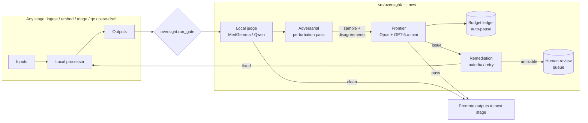

# Medii — Cross-Cutting Frontier Oversight Harness

> **STATUS: IMPLEMENTED on 2026-04-15.**
> **Architecture pivoted on 2026-04-25** from Anthropic + OpenAI direct
> SDKs to a cloud-first OpenRouter cascade (single API key, three
> independent providers across cheap → cross-check → deep tiers). Local
> Ollama is now an OPTIONAL fallback (`MEDII_OFFLINE=1`) rather than the
> primary judge. See `CHANGELOG.md` → "OpenRouter Cascade Wired" and
> "Cloud-First Cascade Pivot" for the current architecture.
>
> The body of this file is preserved as the original design for context.
> **Most of the verbatim model IDs and "files to add" plan are stale** —
> read `src/oversight/router.py`, `src/oversight/frontier.py`, and
> `src/oversight/config.yaml` for the current cascade implementation.

## Context

Medii currently has four local stages (`01_ingest` → `02_embed` → `03_qc_audit` → `04_image_triage`) plus anchor manifests. Quality is only checked *at the end* by `03_qc_audit.py`, and even that uses a single local judge (Gemma 4 via Ollama). The master PWA plan (`medical_learning_pwa_1c60f761.plan.md`) already calls for staged gates, sample-based frontier audits, a Stage 4.5 independent critic, and case authoring on top of this pipeline — but none of that oversight exists yet, and `02_embed.py` doesn't even produce vector embeddings.

The user wants: **one oversight layer that wraps every stage**, runs a small representative sample through cheap local judges first, escalates to a SOTA frontier model only when it matters, and either flags or auto-remediates issues — all inside a hard £150 / ~$190 budget. Adversarial "GAN-style" perturbation tests catch silent failure modes without needing to train a generator locally. Same harness later plugs into the case-authoring loop (Stages 2–5 of the master plan) without re-architecting.

Frontier choice (per user): **Opus 4.6** as the deep critic, **GPT-5.x-mini** (latest cost-efficient OpenAI tier; exact model ID confirmed at commit time) for high-volume cheap audits. Local stack targets the RTX 3070 (8GB VRAM) — MedGemma 4B, Qwen 2.5 7B, BGE-M3 — strictly one-at-a-time.

GitHub: user will push the branch upstream themselves; no remote is configured in this worktree.

## Shape of the change

**Key property:** frontier calls happen on **samples + disagreements only**, never on the full corpus. Everything in-pipeline stays on the 3070. `oversight.run_gate` is the single entry point every stage calls.

## Files to add

- `src/oversight/__init__.py` — package export of `run_gate`, `BudgetLedger`, `StageResult`.
- `src/oversight/config.yaml` — thresholds, model IDs, sample sizes, budget cap, per-stage rubric refs.
- `src/oversight/budget.py` — SQLite-backed ledger (`db/frontier_cost_log.sqlite`), hard-stop raise at cap, soft warn at 80 %, reads `MEDII_BUDGET_USD_CAP` from env (default `190`). Pricing tables for Opus 4.6 and GPT-5.x-mini live in config so they can be updated without code.
- `src/oversight/local_judge.py` — Ollama REST wrappers for **MedGemma 4B IT** (image + medical text sanity) and **Qwen 2.5 7B Instruct** (structured JSON verdicts). Reuses the `_ollama_check` pattern already in `src/03_qc_audit.py:235` — extract and share it, don't duplicate.
- `src/oversight/frontier.py` — Anthropic + OpenAI clients, retry with exponential backoff, per-call token accounting that writes to the ledger. Two entry points: `critique_opus(prompt, schema)` and `audit_gpt5mini(prompt, schema)`. Both return Pydantic-validated JSON; malformed → one retry, then fail closed.
- `src/oversight/gates.py` — the `run_gate(stage: str, samples: list[Sample], reference: Reference) -> GateVerdict` contract. Orchestrates: local judge → adversarial pass → (conditional) frontier audit → remediation routing. `GateVerdict` = `pass | pause | human_required` plus findings list.
- `src/oversight/adversarial.py` — the user's "GAN-style" layer, implemented as perturbation + paired-judge disagreement (no training). Built-in transforms: typo injection, image downscale/crop, chunk-boundary shift, synonym swap, caption removal. Asserts output labels are stable; flags when they flip. Also runs two frontier system prompts in opposition ("critic" vs "defender") and routes disagreements to `human_required`.
- `src/oversight/remediation.py` — maps finding codes to auto-fix strategies: `RECHUNK_SMALLER`, `REEXTRACT_DOCLING`, `RETRIAGE_WITH_VISION`, `REEMBED`, `HUMAN_ONLY`. Each strategy capped at 1 retry; on second failure, enqueue to `db/review_queue.jsonl`.
- `src/oversight/qrels.py` — golden retrieval tests for the embed stage: `{query, expected_chunk_ids, min_rank}` seed file + recall@K harness. Pipeline fails closed if recall drops vs previous baseline.
- `src/oversight/seed_samples/` — authored "poisoned" regression samples (garbled OCR page, mislabeled JUNK image, swapped-caption pair, contradictory chunk). The pipeline must detect each on every run.

## Files to edit

- `src/01_ingest.py` — after each PDF → MD, collect the pair into a stage sample buffer. At end of `process_books` / `process_bmj` / `process_litfl`, call `oversight.run_gate("ingest", samples, reference)`. On `pause` verdict, short-circuit the remaining stages and print the reason.
- `src/02_embed.py` — **two changes**:
  1. Finish the stage: actually embed chunks with `BAAI/bge-m3` (sentence-transformers) and persist into ChromaDB at `db/vector_index/` (directory already referenced in `ARCHITECTURE.md:15`). The chunking and SQLite upsert at `src/02_embed.py:720` stays; embeddings get added alongside.
  2. After embedding, call `oversight.run_gate("embed", qrels_samples, baseline)` using `src/oversight/qrels.py`.
- `src/03_qc_audit.py` — replace the ad-hoc `_ollama_check` (`src/03_qc_audit.py:235`) with `oversight.local_judge.qwen_json(...)`. Add a new **Tier 2.5**: after Tier 2 finishes, pass 5 % of Tier-2 PASSes and 100 % of Tier-2 flags to `oversight.frontier.audit_gpt5mini` to verify the local judge isn't systematically wrong. If local-vs-frontier disagreement > 10 %, emit `LOCAL_JUDGE_MISCALIBRATED` and fail the gate.
- `src/04_image_triage.py` — swap the grey-zone vision call from generic Gemma to **MedGemma 4B IT** (pull via `ollama pull medgemma:4b`). On samples where MedGemma output is `REVIEW` or below a confidence floor, escalate to `oversight.frontier` Opus vision for tie-break. The heuristic rules at `src/04_image_triage.py:40-99` stay unchanged (they are cheap and correct).
- `requirements.txt` — add `anthropic`, `openai`, `pyyaml`, `pydantic>=2`, `python-dotenv`. `chromadb` and `sentence-transformers` are already listed — they finally get used.
- `.gitignore` — add `.env`, `db/frontier_cost_log.sqlite`, `db/review_queue.jsonl`, `db/vector_index/`.
- `AI_HANDOFF.md` — replace the stub "02_embed next step" with the oversight harness spec and the current budget ledger location.
- `CHANGELOG.md` — append a new dated section for the oversight integration.

## Per-stage gate specs (concrete)

| Stage | Local judge | Sample size | Adversarial pass | Frontier escalation |
|---|---|---|---|---|
| `ingest` | Qwen 2.5 7B — "does MD faithfully represent the PDF page?" using page-image + extracted text | 8 pages per book (largest + random) | Table-destruction detector on pages with ≥1 detected table | Opus 4.6 on 2 worst pages + any table-destruction flag |
| `embed` | BGE-M3 recall@10 vs `qrels.py` golden set | All qrels (~30–200) | Perturbed queries (typos, synonyms) — must still recall within tolerance | GPT-5.x-mini on 10 random chunks for coherence + image linkage sanity |
| `triage` | MedGemma 4B IT on grey-zone images | Every REVIEW image (cheap, local) | Downscale / crop perturbations on 5 % of CLINICAL labels | Opus 4.6 vision on MedGemma disagreements + low-confidence borderline cases |
| `qc` | Qwen 2.5 7B — existing Tier 2 coherence prompt | Existing 10 % sample | N/A (QC is itself the adversarial pass) | GPT-5.x-mini audits 5 % of PASSes + 100 % of local flags |
| `case-draft` (future) | Qwen 2.5 7B — schema + citation check | Every draft | Author-vs-critic disagreement prompt pair | Opus 4.6 = Stage 4.5 critic; GPT-5.x-mini = Stage 5 verifier |

Sample sizes, budget caps, and model IDs all live in `src/oversight/config.yaml` — no magic numbers in code.

## Budget discipline

- Opus 4.6 and GPT-5.x-mini list prices pinned in `config.yaml`; ledger multiplies tokens-in/out per call.
- Default cap: **$190** (≈ £150) with 80 % warning. Hard-stop raises `BudgetExceeded` which `run_gate` catches and converts to `pause` verdict.
- Frontier calls are **strictly sampled** — never run Opus over the whole corpus. 80 % of spend is expected to sit in adversarial + case-critic passes; the rest is bulk sampling audits on GPT-5.x-mini at ~100× lower rate.
- Ledger file is gitignored but has a `--report` CLI (`python -m oversight.budget --report`) to print per-stage spend and remaining runway.

## Reused code (do not reinvent)

- Ollama REST pattern — extract the `_ollama_check` function at `src/03_qc_audit.py:235` into `src/oversight/local_judge.py` and have `02_embed.py:114` (the `_llm_find_content_start` that re-implements the same HTTP pattern) call it.
- Anchor manifest lookup — `_load_anchor_manifest` at `src/02_embed.py:349` and `_build_anchor_lookup` at `src/02_embed.py:362` feed the image-triage gate directly.
- Image swap/rescue detection — `_validate_image_placement` at `src/02_embed.py:522` is already an adversarial check in spirit; register it as an oversight adversarial transform instead of duplicating.
- QC report writer — `compile_report` at `src/03_qc_audit.py:350` gets a third `tier3_findings` arg so oversight findings flow into the existing `db/qc_report.json`.

## Verification

1. **Unit sanity**: `python -m oversight.budget --simulate 50000 50000 opus` should add ~$7.50 to the ledger and not raise.
2. **Seed regression**: `python -m oversight.gates --stage ingest --dry-run` feeds the poisoned samples in `seed_samples/` through the full gate and asserts every planted defect is detected. Any miss fails CI.
3. **End-to-end on existing test corpus**: run `python src/01_ingest.py` with `TEST_MODE=True` (already the default at `src/01_ingest.py:370`) — expect ingest gate to PASS, embed gate to PASS once qrels file is seeded, triage gate to PASS on the LITFL images that are already extracted.
4. **Disagreement drill**: deliberately mis-label one CLINICAL image as JUNK in triage; rerun. Expect Tier 2.5 to flag `LOCAL_JUDGE_MISCALIBRATED` and the gate to return `pause`.
5. **Budget drill**: set `MEDII_BUDGET_USD_CAP=1` and rerun any stage; expect the first frontier call to raise `BudgetExceeded` and the gate to return `pause` cleanly without corrupting the ledger.
6. **Manual review queue**: check that seed samples marked `human_required` appear in `db/review_queue.jsonl` with severity, stage, and suggested remediation.

## Out of scope for this change

- Actually *running* case drafting (Stage 4) — the harness is wired for it but the drafter lives in a separate follow-up change.
- Web-scrape tier (BMJ/LITFL re-scrape) — existing raw data is assumed intact.
- UK-MLA / USMLE curriculum auditor (Stage 7) — reuses the same oversight primitives but is its own ticket.
- PWA runtime — untouched.

## Model-ID reminders (confirm at commit time)

- `anthropic` model string: `claude-opus-4-6`.
- OpenAI cost-efficient tier: user said "GPT-5.4 mini". Confirm exact model ID before committing `config.yaml` — the live API name as of April 2026 may be `gpt-5.1-mini` or `gpt-5-mini-latest`; do **not** hardcode a string that 404s.
- Ollama tags: `medgemma:4b-it-q4_K_M`, `qwen2.5:7b-instruct-q4_K_M`, `bge-m3` — pull on first run, fail the gate with a clear message if absent.

